---
tags:
  - 旅行
path: dong-jing-du-zi-lv-xing-you-ji
---

在两段工作经历之间的假期，我安排了一周的独自旅行。理论上，已婚有娃人士很难有独自旅行的机会。但是，此次从钉钉辞职，虽然早有预感，但真正决意也就在骤然之间 —— 说辞就要辞了。自己名下的二十多天假期须尽快休掉，晓辰最近又忙，一时无法脱身，这才有了我这次的独自旅行。人生啊，就是计划赶不上变化，我几乎没做攻略，只定了酒店，就登上了飞往东京的航班。

## 第一天

降落成田机场已是傍晚。我的住宿订在秋叶原，本想搭乘京成本线到上野，但我却误上了一列先走京成线，然后接入总武线的列车，往千叶方向去了。我在千叶换乘了中央线，到达秋叶原已经夜里十点多。

路上行人渐少，大多店铺也已经打烊。虽然下着绵绵的细雨，但我还是套上外套，下楼在附近的几个街区兴奋地溜达了一圈。

酒店就在秋叶原站上方，我的房间位于较高的楼层，视野很棒。我喜欢视野好的房间。

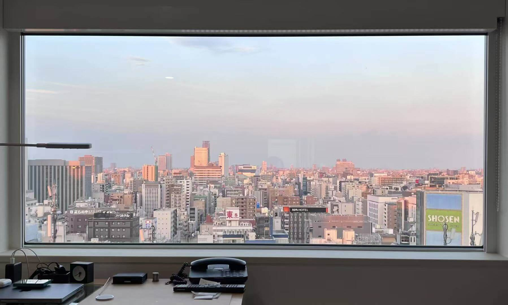

## 第二天

### 上野公园

我在东京造访的第一个目的地是上野公园。这座公园历史悠久，又是赏樱圣地，名气很大，连鲁迅的《藤野先生》都是这样开头：「东京也无非是这样，上野的樱花烂漫的时节……」。公园里有几处古迹，有不忍池，但除此之外，这座公园似乎也没有什么大不同之处。孔子说「近则不恭」，看来也适用于人对物的情形。大概因为是早晨，游客不多，很是幽静，但是公园中心的长条喷泉池四周却很热闹，穿着宽大校服的小学生或列队，或席地而坐，颇像国内小学生春游的样子。

### 东京国立博物馆

喷水池广场北侧就是东京国立博物馆。我买一张票，走进去，偌大的一个庭院。主馆建筑门前杵着一株茂盛的银杏，弯曲粗壮的树干顶着张牙舞爪的树冠，在行道上投下斑驳的影子。树木上了年纪，和人上了年纪一样，总能现出一些不修边幅的气质来。忽然「哇——哇——」两声，两只乌鸦从树冠上飞起，藏到主馆建筑屋顶的缝隙里去了。东京的乌鸦很多，后来我在银座和涩谷都有听到乌鸦的叫声。

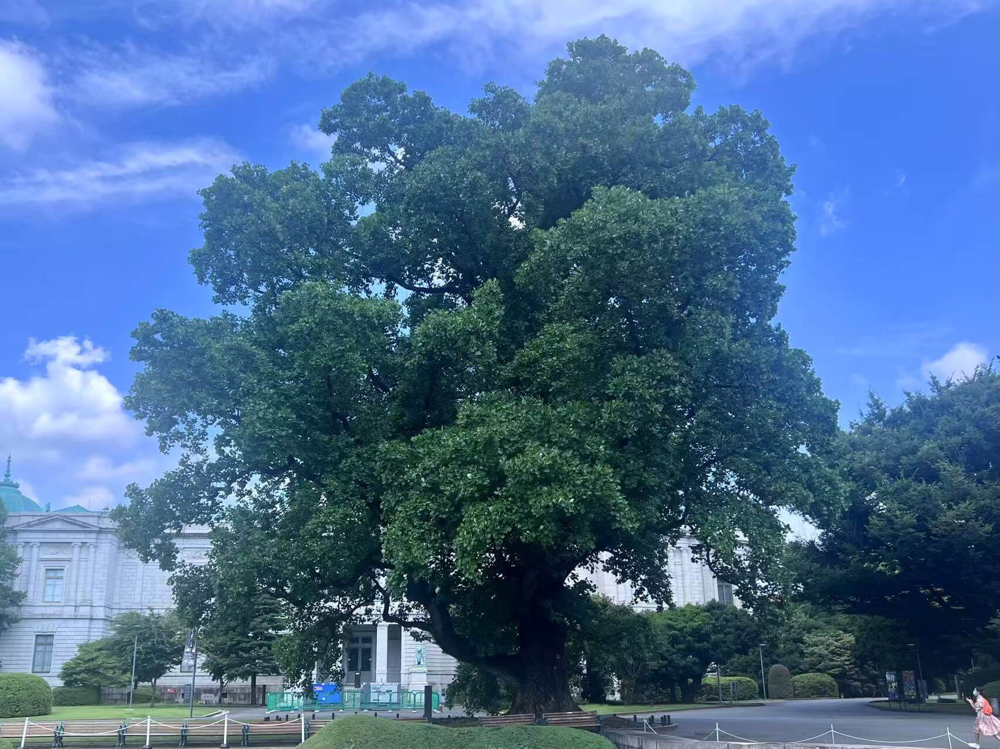

博物馆的文物，印象最深刻的有两件：一件是遮光器土偶，日本绳纹时代陶偶，特点是巨大的宛如遮光器（即飞行员护目镜）的眼睛；我注意到这件文物，是因为《文明 7》游戏中就有一个名为「遮光器土偶」的领袖属性点 —— 原来是出自这里。另一件是日本武士铠甲中的一具，这套铠甲使用黑色的皮毛装饰，头盔上还配备了一个威武的金属面具，使我想起《只狼》中的苇名一心。

### 北斋美术馆

北斋美术馆位于墨田区，从两国站出来，步行一公里左右到达。美术馆拥有银灰色金属质感的外墙和现代风格几何形状的造型，坐落在一片安静的住宅区中。那幅最著名的**神奈川冲浪里**，虽然馆藏确有一幅真迹（浮世绘是近代的印刷品，所谓「真迹」的存世数量并不特别稀少），但不常驻展出，能见到的只是复制品。

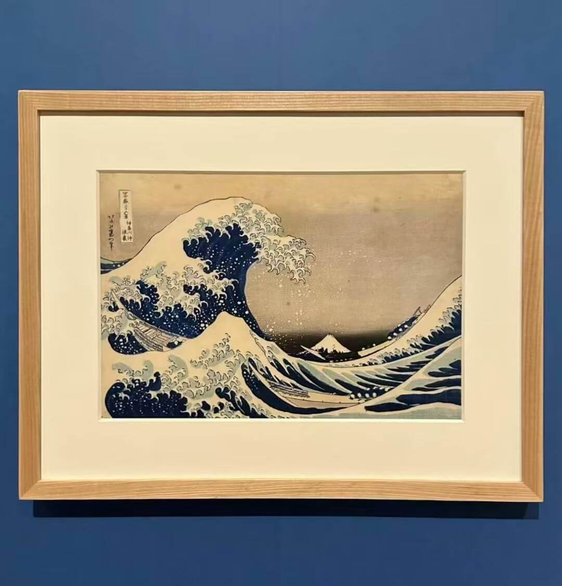

美术馆北侧是一片空地，用栏杆围起，空地上立着有秋千，球门，还有一个小型的旋转木马。这种小型社区公园在日本似乎很常见，设施虽不很新，但维护得极好，几乎没有坏的。去年关西旅行的时候，我也多次注意到这样的小公园，傍晚时分，有很多七八九岁的孩子聚集在公园里呼喊着玩耍，而且不太见到在旁看护的家长。

这种社区氛围使我想起，自己七八九岁时，夏日傍晚，在公房前的泥土空地上，和玩伴们打玻璃弹珠的日子。必须太阳西沉，天色已昏暗到难以看清地面上的弹珠时，才肯依依不舍地回家。如今国内，已经很难想象家长会放心让七八九岁的孩子在外独立玩耍了。

### 友都八喜秋叶原

晚上，好好逛了一下秋叶原最大的电器城友都八喜。顶楼的游戏机区域很是吸引我，可惜的是 Switch 2 国际版全部缺货；我很是想买些什么有趣的主机配件之类，但没有看到特别亮眼的，又不想空手而归，最后买了一个任天堂闹钟。

电器城这种业态，在国内已完全被电商取代了 —— 标准化产品的价格过于透明，消费者现场体验线上下单的问题，几乎是无解的。想不明白，日本的电器城为什么还能继续存活。

## 第三天

### 浅草寺

第三天早晨，出发去浅草寺。浅草寺周围主要是招待游客的商店街，我到得早，店铺大多还没开门，街道上空荡荡的。浅草寺占地不大，建筑也不多 —— 除了主殿和五重塔，就是影向堂（御朱印在里面），不似京都清水寺或杭州灵隐寺那般层层叠叠。洗过手，走进主殿。抽了一签，是吉签。签语是：「盘中黑白子，一着要先机。天龙降甘霖，洗出旧根基。」

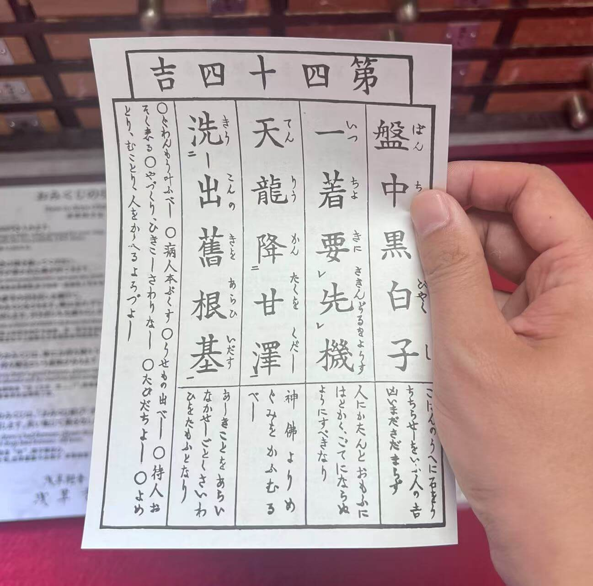

当我沿着仲见世商店街离开时，店铺才陆陆续续开始营业，有游客聚集在雷门拍照。我前往隅田川方向，晴空塔矗立在远处。
### 银座

银座大概是我到过的最豪华、最昂贵的商圈了。这里路网密集，一个街区只有一两栋建筑宽。我走马观花地穿过三越百货、银座松屋，打卡了百年老店和光百货。和光百货实在是高档，宽阔而一尘不染的走廊，老派而奢华的玻璃柜，衣着精美的工作人员，令我走进去的时候不由地屏住呼吸。

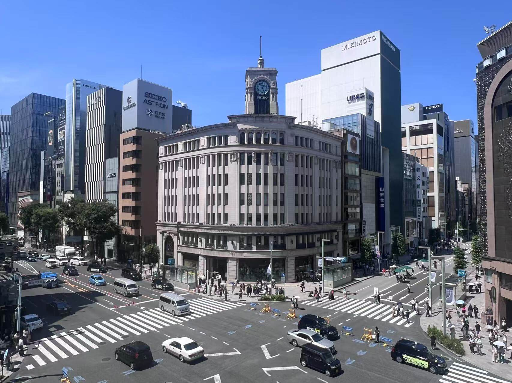

银座的街道给我的感受是「安静」，一种与其繁荣不匹配的安静：没有混杂着各种语调语气的高频人声，只能偶尔听到被刻意压低的窃窃私语。我能清晰地听到汽车驶过，引擎的突突声，轮胎摩擦地面的沙沙声，能听到皮鞋和高跟鞋踩在地面上的哒哒声，风吹动树叶的哗哗声，吹动广告旗帜的呼呼声，甚至能隐约听到远处，火车压过铁轨的咚咚声，车厢晃动的哐哐声。印象最深刻的是和光百货钟楼的整点报时：响亮的「当——当——」的钟声在沉默的人流上空盘旋，那一刻，这种安静的感受尤为强烈，我大概对日本社会中某些礼貌和压抑的特质也有了更生动的体会。

逛得最久的店铺，是银座的 MUJI 无印良品旗舰店。我很难掩饰对 MUJI 品牌的喜好，它的极简留白的「空容器」风格真是打在我的心头上。我大概有超过一半的衣物和各种日用品来自 MUJI，所以造访这家世界上最大的 MUJI，也算我到东京必做的事情之一。

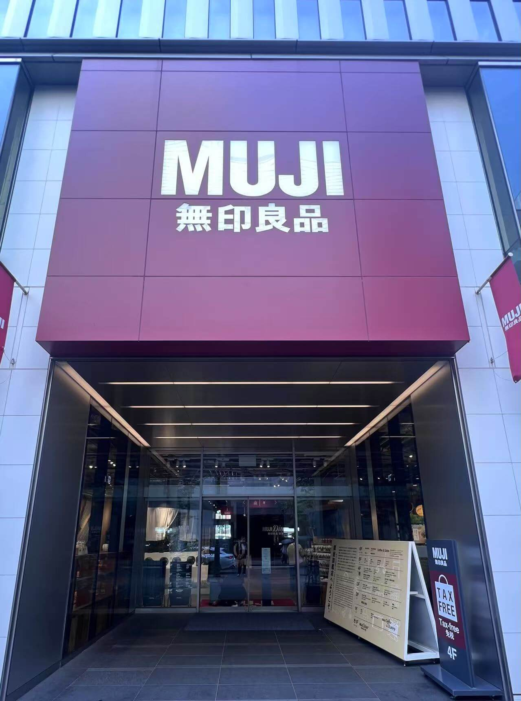

这家 MUJI 的一楼是一整层食物，有新鲜面包、新鲜蔬菜（规格外野菜）、便当速食、零食饮料、甚至还有各种各样的调味料。其实我一直不理解国内 MUJI 门店怎么会有软糖和咖喱这种和家居主题完全不搭的商品，原来 MUJI 是有完整的食品板块的。二楼到五楼和国内门店差不多，只是商品的款式似乎更全一些。买了些小东西，退税柜台的收银员普通话比我还标准。六楼以上是 MUJI Hotel，餐厅对非住客也开放。我喝了一杯美式，然后离开了。

### 东京铁塔

东京铁塔，因为频繁出现在《奥特曼》中，频繁被怪兽摧毁，成为儿时我对东京的第一印象。傍晚从秋叶原出发，搭日比谷线，到神谷町出站，天已黑了大半。这一带的城市风貌令我感到熟悉：宽阔的马路，高档而略冷清的玻璃外立面高楼，很像国内的一些地方。快到永井坂路口时，先是看见前方很多游客正举着手机拍照，再快速走几步，红通通的铁塔就忽然从楼宇背后跃出，高耸着矗立在我的眼前中。

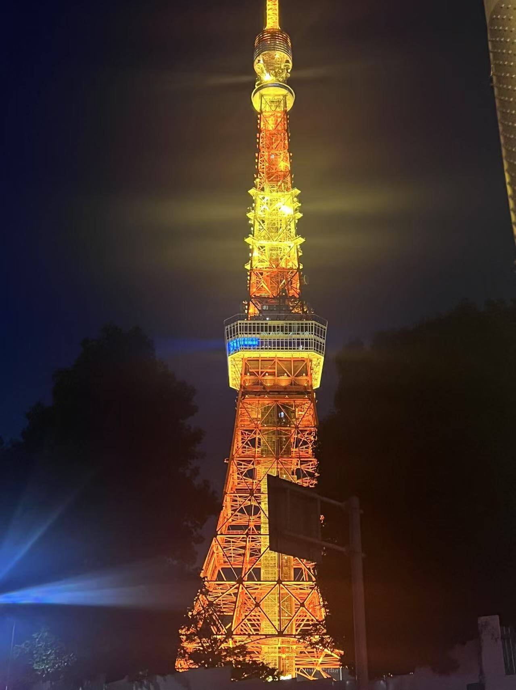

游客大部分是南亚、东南亚人，也有少数白人，中国人很少。我跟着人流向前，很快就到了塔底的游客中心。我便去买票，排队乘电梯上塔。

塔上的夜景令人震撼：几乎无遮挡的视野中，全是密密麻麻，连成一片的灯火，似乎要从所有的缝隙里都生长出来，就像丛林一样 —— 令我想起在香港太平山顶观景台所见的灯火 —— 饱含着一种健壮无序的力量。

观景台内部就没有什么特别之处了。主观景台上的顶层观景台，排队时间太久，而且排进去后的流程也是无趣冗长，竟然还有免费（半强制）拍照，收费取照的桥段，令人大跌眼镜。十一点多，我才回到酒店。

## 第四天

### 吉祥寺

从地图上看，东京的周边地区似乎是由一个个小镇组成，每个小镇都有一个火车站，火车站辐射出相当规模的繁华商圈，再往外是安静的住宅区。吉祥寺就是这样一个小镇，去吉卜力美术馆需要在这里下车，然后步行过去。这里位于东京西部，与东京核心区有一段距离，从秋叶原搭火车花了一个小时才到。再往西，就到立川了，那里是 Falcom 法老控公司的所在地，也许可以朝圣一二，我想。但我还是在吉祥寺下了车。

吉卜力美术馆的门票有严格入场时间，我到早了，因此在吉祥寺闲逛了一两个小时。这个理论上只服务周边地区的小镇，它的繁荣程度大大出乎我意料。这里有密集的超市、特色餐厅、咖啡厅，各种各样文具店、电子产品商店，连锁书店，还有一整栋楼的优衣库，甚至还有专门卖烟斗和卖灯油的店 —— 真是不敢相信。本地人悠闲地在精致的街道和店铺里消磨时光，就像乐高街景里的人偶与建筑一样协调。可以说，与长三角地区普通地级市 —— 比如我的家乡南通，或扬州、无锡、嘉兴、金华这类城市 —— 市中心最好的商圈相比，也完全不输。可是，这只是东京市郊的一个普通小镇，这么说，东京可真是踏踏实实的繁荣啊。

### 吉卜力美术馆

从吉祥寺前往吉卜力美术馆，需要穿过井之头恩赐公园。高大的乔木，茂密的草丛，没有铺装的泥土小径，使我联想起《龙猫》中姐妹俩居住的乡下房屋。美术馆内，有以影片中形象为素材，展示视觉暂留原理的设施；有真实的早期手稿、原型图等「文物」；还有一个龙猫主题的儿童乐园 —— 真的可以进入到龙猫巴士内部；门票还包含一场小剧场中的动画短片（似乎不会在外部渠道放映，而且会定期轮换）。美术馆唯一可以拍照的地方是屋顶的天空之城机器人塑像。

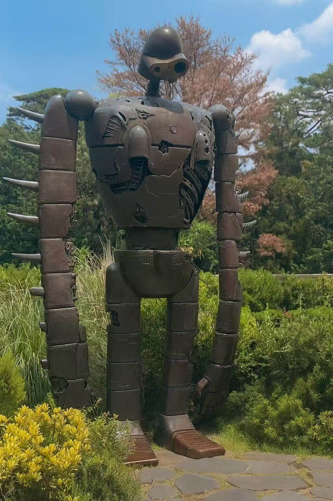

### 涩谷

搭乘京王井之头线，从吉祥寺到涩谷。我匆匆打卡了世界上人流量最大的涩谷十字路口。这种路口的信号灯是「行人全向通行」的。当行人绿灯亮起，数百人甚至上千人同时从四个街角像鱼群一样涌出，形成若干股巨大的人流，四个方的车流全部停下，你会产生有一种身在舞台的感觉。

因为没有预定，我没能上得去涩谷最有名的天空观景台。简单逛了逛，我就开始在庞大的由天桥、通道组成的迷宫中，寻找前往代官山的路。经过涩谷溪流大厦时，我有看到 Google 的指示牌 ——查询后发现，这里正是 Google 东京的两个主要办公地点之一。

### 代官山

沿着涩谷溪流大厦楼下的一条无名小路，向东南方向步行一段，然后经猿乐桥跨过铁路。街道一下子安静了，这就到了代官山区域。再向前走两公里，就到了代官山森林之门 —— 这个建筑和上海天安千树有点相似。

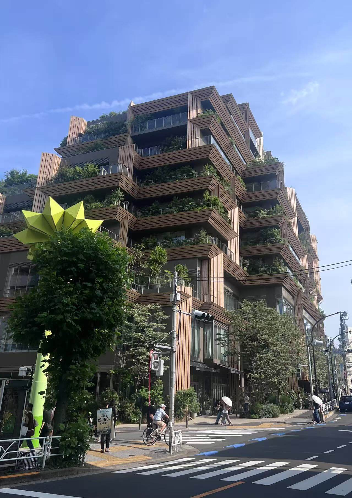

在森林之门这个路口右转，折进一条文艺的小路，很快就来到了代官山茑屋书店。这家茑屋书店可比杭州天目里的那一家茑屋书店大了不少，由三栋相互连接的二层建筑组成，其中一栋建筑二层是酒吧，几乎满座了。

这家茑屋书店有挺大一片区域是关于汽车主题的，里面有各个汽车品牌的相关的书籍、画册、海报、模型等等，挺有意思的。另外还有一块 SHARE LOUNGE 区域 —— 也就是收费休息/办公区，即使不点任何饮食，进入休息区也要收费，而且是按时长计费。比起更为常见的把餐食和空间捆绑售卖的商业模式，以及随之而来的「消费落座」或者「最低消费」的别扭规则，这种业态倒是更对我的口味。

我对书店很着迷，每到一个新的城市，我几乎总要寻找当地的有名的书店游览一番 —— 即使在日本，满屋子都是日文书，我还是情不自禁。这大概和我的童年经历有关：在从小镇刚搬入市区的头两年，家里没有空调，夏天特别热。为了避暑，有两个暑假，我几乎每一天都泡在南通书城里看书，早出晚归，中午就在摊子上吃一个油饼。

满满四层楼的书，给当时的我带来了极大的震撼 —— 任何能想到的问题，似乎都能在这里找到答案，我产生了「和世界连接上」的感觉。那两个暑假泡在书城的日子，其实也是我第一次脱离父母老师管束，自由安排活动 —— 因此直到现在，每次我步入书店，都本能地涌起一股轻松的情绪，令我上瘾。

### 新宿

在代官山站搭乘副都心线，一会儿就到新宿三丁目。出站后，我把步行导航目的地设置为歌舞伎町一番街：怀着纯粹的好奇心，我有意探索这片东京最著名的「红灯区」。

新宿的街道没有明显的区域风格，也没有令人瞩目的标志性地点 —— 到处是商店、霓虹灯、人流 —— 和其他地方一样。新宿给我的感觉是巨大、沉闷、没有尽头。时不时地，脚底隐隐传来火车行驶的震动时，我觉得自己在一颗孜孜不倦地跳动着的心脏里 —— 就是这个感觉，巨兽的心脏。

在跨越新宿站的桥梁上，我看到有大概是乌克兰人/裔在组织谴责俄罗斯的示威活动，举着蓝黄相间的旗帜。街头政治，国内几乎不可能见到。最近日本好像正在进行的选举，有一天在秋叶原酒店楼下也看到国民民主党的街头宣传。

歌舞伎町一番街，其实很短，大概只有两三百米长，街道两边一楼主要是餐厅、酒吧，二楼以上，根据霓虹灯招牌判断，应该有相当比例是软色情营业场所 —— 窄窄的楼道通往地面，只在一楼开一个小门，门前摆着包括价格明细的广告牌，还有女仆或其他 cosplay 装扮的年轻女性在门前招揽顾客。之前和晓辰一起在泰国旅行时，我们也探索过芭堤雅的红灯区，歌舞伎町与之相比，更加整洁清冷 —— 还有正常营业的餐厅，也没有人主动搭讪。

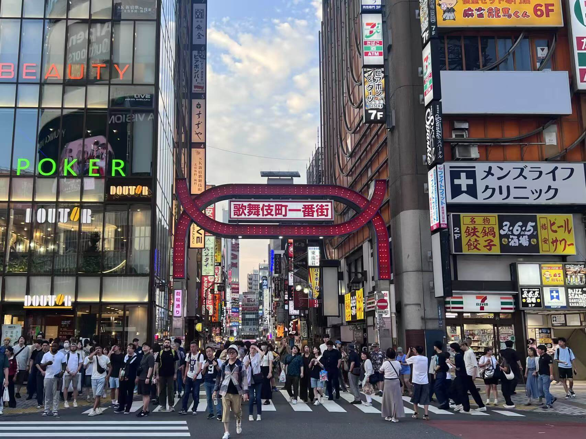

出卖身体换取金钱，真是一件颇为可悲的事情 —— 但是，联想起国内普遍超长的工作时间与缺乏尊严的职场环境，我又有什么资格去评判别人呢。

## 第五天

前一天晚上，我就一直在考虑接下来是去台场还是镰仓，毕竟来东京旅行，怎么着也得见一见东京的海才行。台场可以去丰州市场看三文鱼拍卖，还有富士电视台大楼，而且台场比较近，下午回来还能去东京大学逛一逛；镰仓比较远，但可以打卡高德院大佛和镰仓高校前。后来我发现，这天是周一，丰州市场没有拍卖，于是就就选择去了镰仓。

### 高德院大佛

去镰仓的火车，坐了一个半小时。从镰仓站出来，我沿着由比滨大通步行，去往长谷和高德院方向。其实直接搭乘江之电更快，但我喜欢步行。我在由比滨大通上发现了一栋极具年代感的建筑，这里曾是镰仓银行由比滨出张所，现在是一个酒吧。

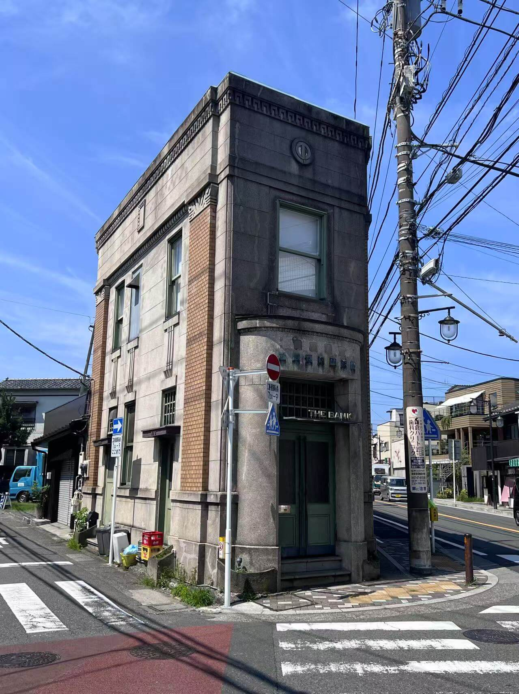

走了两三公里，到长谷大道路口，右拐上坡，游客开始多起来了 —— 不仅有国际游客，也有不少日本国内游客（甚至很多应该就来自东京）。恰巧，我和三四个中国游客擦肩而过，他们正在说南通话 —— 南通话是如此小众又难懂，以至于我和晓辰已经习惯于把南通话当做「公共场合的加密语言」来使用。当我听到这几名游客在用南通话点评一家古旧店铺内的商品时，我甚至感受到一种窥听的紧张。

整体上，镰仓的街道给我的感觉有点像冲绳，有一种「历史的厚重」和「度假的轻松」糅合在一起的味道：上了年龄的木质老屋和稍新的现代房屋交错在一起，沿街的建筑大多布置成餐厅或各种商店，店铺门口的冲浪用品和远处若隐若现的大海提醒着你，这里是海边。

高德院，其实不算太大，检票进去直接就看到了露天的大佛：青绿色的金属材质，大概三四层楼高。据说之前可以进到大佛内部，但是我没有看到。高德院大佛最早不是露天的，而是在大殿之中，但是大殿毁于海啸。后来镰仓幕府衰落，日本政治中心重新移回京都，镰仓当地也不再有资源来重建这座大殿，久而久之，露天的大佛就成了新的地标景观。《文明 6》游戏里的世界奇观高德院，建成时大佛就是露天的，并不严谨。

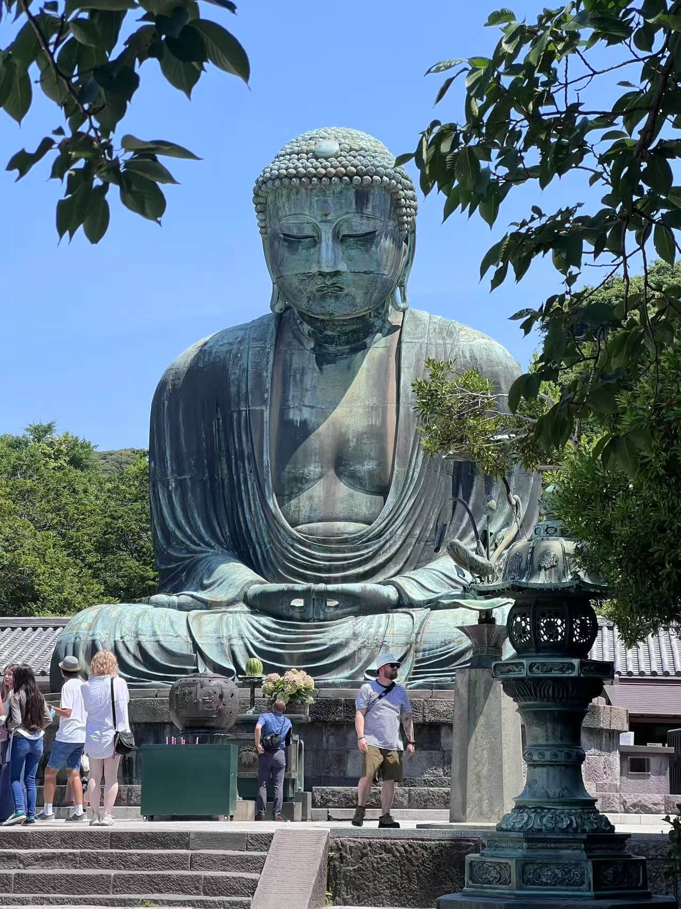

日本的景点，即使如镰仓大佛这种，极具分量的历史遗迹，其配套设施也比较简单，不占用太多土地，能够和周边环境融洽共处，就像放在纸盒中的珍珠一样。而国内的很多历史遗迹，修建大量配套设施和商铺，一道门套着一道门，甚至还需要用上接驳车，高下是不言而喻的。

### 镰仓高校前

镰仓高校前的丁字道口，因出现在《灌篮高手》片头中而成为著名的动漫圣地，以至国内很多同时拥有有铁路轨道和海岸风光的地方，在社交媒体上都被称为「小镰仓」。

从高德院出来，原路下坡，走到长谷电车站，搭江之电前往镰仓高校前。电车上很热闹，中国人很多，我旁边的两个男人大声谈论着上海和东京的房价，还有举着小红旗的导游扯着嗓子提醒团里的游客下车地点。我是一个不喜欢喧嚣的人，但在当时，作为一个独自在异国旅行了快一周的游客，我感到切实的亲切和轻松。列车冲到开阔地带，湛蓝的太平洋一下子映入眼帘，整个车厢的中国人一起发出了「哇哦」了呼喊，然后继续沉入喧嚣之中。

很快电车就到站了。镰仓高校前站特别小，简单说就是一个长条形的亭子。列车离开后，我在站里找了一个座位坐下来，直接就面朝大海了。我吹了一会儿海风，在隐约的海浪声中发了一会儿呆。

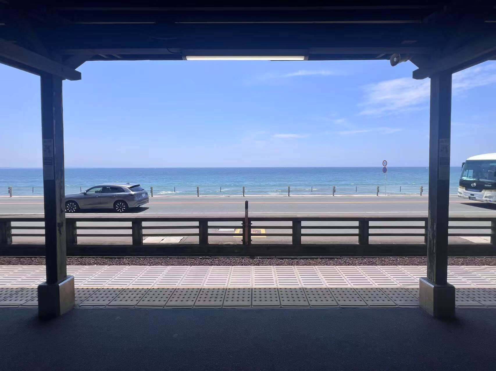

然后出站，去网红道口看了一眼，很多人在排队拍照。电车很久才会有一趟，恰好能与电车合影的，都是幸运儿。

接下来，我沿着高校前路口上坡，本想随意探索一番，结果走了好长一段，大约三四公里路程，最后到达了腰越站。这一路都是安静的住宅，几乎没有商店，甚至没见到什么人。在腰越站穿过轨道后，又回到了海边。沿着 134 过道向西，又走了一两公里路，就到了须花通。

这是一条通向江之岛的小道，路边有不错的西餐厅、售卖奶油布丁的小店、海洋风的纪念品商店、颇具设计感的首饰和服装店，和刚刚走过那么远的「荒芜之地」相比，实在是太可爱了。又累又饿，还没吃午饭的我在这里吃了一个虾仁奶油三明治，喝了一大杯热拿铁。

太阳有点斜了，我决定返程。从湘南江之岛搭乘湘南线到大船，再换火车到东京。湘南线是吊挂式的轨道，车体悬于轨道下方，这是我第一次乘坐吊挂式列车。

### 秋叶原

晚上，重新逛了逛秋叶原。第一天重点在友都八喜这种电器卖场，其实秋叶原还有海量的中古品（二手商品）商店：中古的动漫周边店，中古手机和游戏主机店、中古相机、镜头和拍立得店，中古书籍、漫画和音像制品店等等。可以感受到，日本的中古商品零售产业相当发达，只要是批量生产的标准化产品，都能按照年份，成色，稀有度等因素，匹配出一个合理的价格 —— 就连银座 MUJI 都有一小块售卖中古家具的区域。

## 第六天

返程有一个小插曲：原计划乘坐的航班，在执飞前序航班（上海-东京）执飞过程中机械故障，备降了大阪，所以我的航班取消了。庆幸之余，改签了下午稍晚的另一个航班。

在秋叶原站搭山手线到上野站，换京成本线前往成田机场，虽然还是慢车，但总算没有绕到千叶去。我惊奇地发现，在华语梗圈小有名气的「我孙子市」，就在这条线上。

傍晚时分，降落上海浦东，搭市域铁到虹桥，搭高铁到杭州，搭 19 号线回家。公共交通是如此完备便捷，普通人的活动半径之大，在一百年前的人们看来，根本难以想象。这是时代给普通人的福利，一定要珍惜啊。
