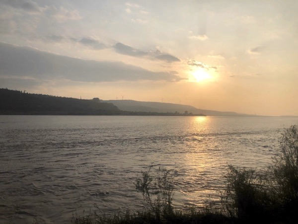
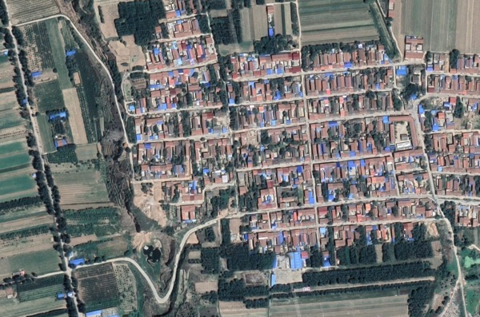
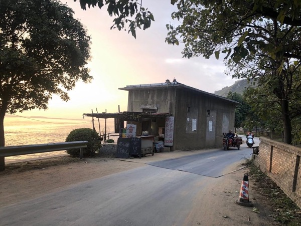
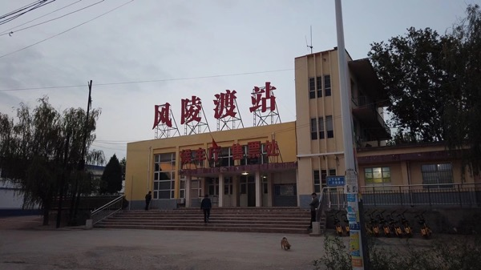

# 风陵渡游记

> 2020 年国庆节期间，我和晓辰完成了一次短途自驾旅行。路线是我策划的：从郑州出发，沿途向西经过洛阳、三门峡、潼关，最终到达西安。这条路线所经过的地区，基本算是中华文明的核心腹地了。当我沿着连霍高速向西行驶，周围从一马平川的平原，变成起起伏伏的小丘陵，再变成黄土高原特有的「塬」和河谷相间的地形；当那些熟悉的和无数历史事件或者文学作品联系在一起的地名：许县、孟津、虎牢、偃师、河洛、函谷、潼关、风陵、华阴、渭城、蓝田、白鹿、灞桥，一个一个出现在路牌上；我时不时地会略微有些「热泪盈眶」，原来这个弱小的个体和这个文明，是如此息息相通。
> 
> 一路上，我们看了很多博物馆和古迹：郑州博物馆、杜甫故里、二里头遗址博物馆、白马寺、龙门石窟、虢国博物馆、风陵古渡、潼关、华山脚下、兵马俑、西安博物院。风陵古渡在这里面是最冷门的一个地方了，它甚至连「景点」都不太算得上。但这个地方却是我策划此次旅行的最初动力 —— 它在金庸迷心中的地位实在是太特殊了。我们颇费了一些周折才到达那里，在那里看了日落，然后又费了很大的周折才得以返回（返回途中还经过一个很有意思的 90 年代风格的风陵渡镇）。

风陵渡其实是我这次关中旅行的最初目的，不仅因为它是晋地入关的必经之路，数不尽历史人物和事件的舞台，更因为它在金庸迷心中极为特殊的地位。

所谓风陵渡口初相遇，一见杨过误终身。风陵渡是郭襄和杨过的初见之所。《神雕侠侣》以杨过小龙女分别的十六年为界，分为上下两个部分，而「风陵夜话」正是下半部分的第一回。杨龙分别十六年后，金庸借初出茅庐的郭襄的视角，引出已成为神雕大侠的杨过，以及后续襄阳大会、宋蒙战争等桩桩大事。杨过以三根金针为信物，答应满足郭襄三个愿望：摘下面具、参加郭襄的生日聚会、无论小龙女是否存活都不可以求死。杨过没能满足最后一个愿望 —— 他在得知小龙女在十六年前已死时，依然选择了跳崖（郭襄也跟着跳了，当然后面是机械降神情节，崖底的寒潭救了所有人）。《神雕》结书后，杨龙隐居，郭襄遍访杨龙不得，终落发出家开创峨眉一派。《倚天》万安寺中，灭绝向周芷若吐露倚天剑的历史，提及峨眉第二代掌门法号风陵师太，与风陵夜话遥相呼应，草蛇灰线，伏笔千里，令人唏嘘。

怀着一颗朝圣的心，我来到风陵渡。从连霍高速秦东出口下高速，经过一个环岛，就可以直接上到风陵渡大桥。黄河由北向南流到这里，被山脉挡住去路，不得不折向东流去，形成了「几」字型黄河最后一笔的「弯」处。黄土高原的土质疏松，河谷深深地下切，把高原切成一块块四边陡峭，顶部平坦的高台，这就是「塬」。不同的塬之间可能相隔只有几百米，人们互相可以望见甚至喊话，但是如果想走过去，需要沿着陡峭的塬壁下到河谷里，再上到对岸的塬顶，路途比直线距离要远得多。

风陵古渡口在河谷中，为了到达古渡口，我们遭遇了一段完全出乎意料的、惊险、令人印象深刻的沿塬壁下到河谷的经历。（平心而论，这段经历一点也不惊险，甚至有一点乏味。但是对于平淡生活中的人，这种「冒险」的机会实在太难得了）。

当我们沿着风陵渡大桥到达黄河北岸时，我完全没有意识到我已经在塬上。长江下游二十余年的生活经验告诉我，只要沿着导航软件中的道路，就可以平稳地到达岸边。然而导航软件把我从大路导上了小路，最后导进了一个小村庄（后来我在地图上确认，这个村子就是芮城县西阳村）。狭窄的村道上，晒着谷子，停着各式摩托和三轮，有闲聊的老人和嬉闹的小孩，我不禁困惑，这条路真能带我到渡口去吗？我们从西阳村东侧的村口行驶到最西侧，在最后一排民房的，也就是地图上显示即将拐弯的地方，周围似乎一下子变开阔了，可是道路不见了，只有一个小凉亭立在道路的尽头。

我们下了车，才发现凉亭的另一侧（东）是悬崖，凉亭北侧一堆麦杆背后，藏着一条略窄，略陡峭，没有围栏的小路，沿着悬崖向北延伸，看不清尽头。最终我们决定还是冒一次险，沿着小路继续向前。这条小路把我们送到了黄河的河谷中一条坑坑洼洼的烂泥路上。沿着这条烂泥路向南，我们向渡口行驶，路上没有其他车，路两边长满了野生灌木和杂草，右边（西）是黄河，在灌木杂草背后若隐若现，左边（东）就是西阳村所在的那块塬了，而且我发现每隔一两千米就会有一条类似的小路从塬顶垂落下来，夕阳从西边照过来，把塬壁照得金黄。我对晓辰说：「好看」，心里想：「真是壮观啊」，心里又想：「这条路可千万别断了」。

又行驶了十几分钟，和几辆大卡车会车之后，我们上了一条柏油小路。这就在黄河边了，车向前行驶，黄河水就在车窗外哗哗地流。又走了一段，前面路边停着一辆小面包，六七个人坐在地上聊天；再向前，路边又停着两辆小车，又有五六个人分两三堆坐在路边，我知道，终于到风陵渡了。

这里真是一个再普通再寻常不过的地方了，如果不是一块不起眼的「风陵古渡」的招牌，你丝毫不会把这里和繁华的交通要到联系起来。但是仔细地看，这里确实是目力所及范围内，黄河最窄的地方，而且也恐怕是方圆百里之内，黄河最窄的地方了。在现代桥梁技术出现之前，山西、河北甚至更远处的人想要到关中平原来，都必须从风陵渡渡河。对岸是说不上名字的山（查了一下叫凤凰山，还挺有名的），山腰上围着是高速公路，山顶矗立着两座风力电站，往西去可以看到潼关古城里建的仿古建筑，再向西南远眺，巍峨的太华山脉在云层中若影若现。我突然想到，虽然周围的环境 —— 这条柏油小路，农家乐，风陵渡大桥，对岸的「潼关古城」，风力电站，高速公路 —— 都是后来才有的，但是站在这里看到的山川轮廓，和古人看到的却没什么两样。且不说那些确凿记载在史料中的，和潼关、风陵渡有关的人物故事，就随便从中国古代史尤其是先秦汉唐史中找一个人出来，你都很难说他从未来过这里。秦灭六国，这里是必经之道吧；汉高祖提剑入咸阳，经过这里吧；李世民，是从太原起兵问鼎中原的，那妥妥是风陵渡的常客了。也就是说，李世民每次来往于太原老家和长安、洛阳之间，都必须经过这里，彼时他在渡口看到的这凤凰山，和我现在看到的凤凰山，轮廓是一模一样的啊！忽然，我有一种触摸到历史的感觉，我和无数的历史人物在某个维度上相遇了。

风陵渡口不远处还有一个小商店，店主是一位老人，他正在斜靠在椅子上，专心地看一部喧闹的古装电视剧。看到我走进来，他看向我，笑着点了一下头，就又把目光挪回电视上了。窗外是哗哗的水流声，五千公里长的黄河在这里拐了一个直角弯，而离这个直角弯最近的人，就是这位看电视剧的老人了。征得他的同意后，我拍了一张照片，因为我觉得这背后有某种只能意会的哲学含义 —— 一个人魂牵梦绕的东西对另一个人而言，可能是最最司空见惯的。

当太阳完全埋进云层里，我们决定返程。返程途径风陵渡镇，这是个九十年代风格的小镇。小镇中心的 T 字路口坐落着火车站、国营饭店、国营旅馆，简直可以作为九十年代电影的取景地。饭店和旅馆都已经被改成了普通名宅，但还保留着当年的门面，只有火车站还在使用。这是我见过最小的火车站，售票窗口只有一个，只在固定的几个时间窗口开放，候车厅不超过一百平，座椅不过十几个，墙上挂着那种九十年代字体印刷的列车时刻表，原来有几班慢车经停此站。车站里只有两个人拉着箱子在候车，此情此景，不由得想起了那篇小学课文《小站》。

返程再次经过风陵渡大桥，桥面上堵车。天已经全黑了，向右侧车窗外望去，黑黢黢的，看不见黄河，更看不见远处的山峦，我听到广播里在讲什么「秦腔」。对哦，陕西除了「陕」，另一个简称是「秦」。我突然想到一个成语：「秦晋之好」，可不就是说的风陵渡这个地方嘛！
