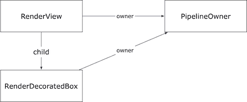
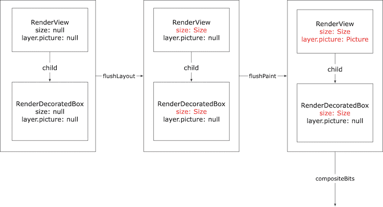
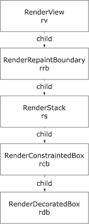
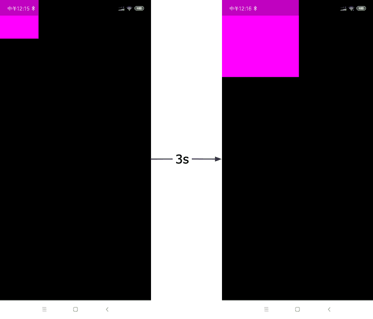
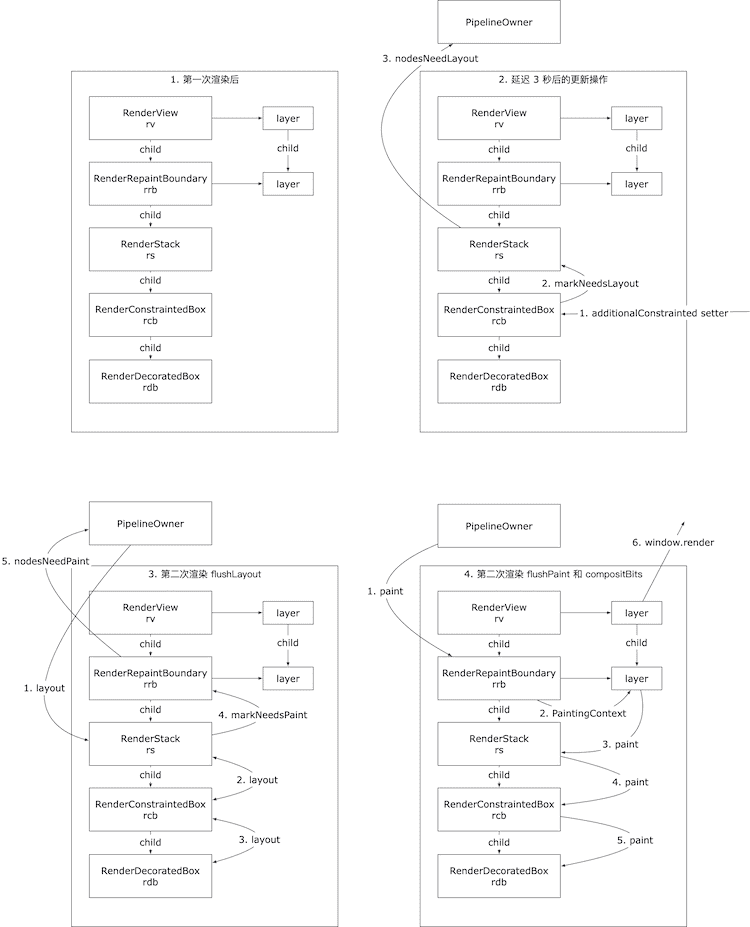

# Flutter Framework 源码解析（3）—— RenderTree 概述

2019 年开始的 Flutter Framework 源码解析系列，一下子竟然搁置了接近两年。这两天过年，又想重新拾起来。仔细读了自己之前写的那两篇，幸好还能看懂，试了试电脑上的运行环境，居然也还能跑起来。近两年过去了，Flutter 升级到了 1.20，而我还是用的 1.2.2 版本，好在 UI 渲染的内核原理，想来不会发生什么大变化，所以这篇文章仍将基于老版本来进行。

我们直接开始吧：

两年前，我们讲到了 Layer —— 离 Engine 最近的一层。Layer 层之上是 RenderTree，这是 Flutter 渲染的核心：Flex 布局，绝对定位，文字排版，等等都是在 RenderTree 中完成的。本质上，你看到的每一个字、每一个色块、图片为什么出现在了屏幕的那个位置，就是由 RenderTree 决定。从这一层开始，我们会接触到一些和 CSS 中相通的概念。

顾名思义，RenderTree 在运行时是一棵树，其中的每一个节点都是一个 RenderObject 对象。这棵树的根，一般是 RenderView 对象（RenderView 继承自 RenderObject）。

## 最简单的 Demo

我们从一个最简单的 demo 开始：

```dart
void main(){

  PipelineOwner pipelineOwner = PipelineOwner();

  RenderView rv = RenderView(configuration: ViewConfiguration(
    size: window.physicalSize / window.devicePixelRatio,
    devicePixelRatio: window.devicePixelRatio,
  ), window: window);

  rv.attach(pipelineOwner);
  rv.scheduleInitialFrame();

  RenderDecoratedBox rdb = RenderDecoratedBox(
    decoration: BoxDecoration(color: Color.fromARGB(255, 0, 0, 255))
  );

  rv.child = rdb;

  window.onDrawFrame = (){
    pipelineOwner.flushLayout();
    pipelineOwner.flushCompositingBits();
    pipelineOwner.flushPaint();
    rv.compositeFrame();
  };
  window.scheduleFrame();
}
```

在这个例子中，我们创建了一个 RenderView 对象 `rv`，又创建了一个 RenderDecoratedBox 对象 `rdb`,并且把 `rdb` 设置成为 `rv` 的子节点。具体的，这里我们把 `rdb` 赋值给了 `rv.child`，这是因为 RenderView 是「只可以有一个子节点」的 RenderObject；如果遇到那些可能有多个子节点的 RenderObject，比如后面要说的 RenderStack，就需要使用 insert 等相关方法来管理子节点了；当然，还有一部分 RenderObject 是不可以有子节点的。

> 在正常的 Flutter 应用中，RenderTree 由更上游的模块维护，在这个例子中，我们手动创建和管理 RenderTree。

其实在此之前，我们还创建了一个 PipelineOwner 对象 `pipelineOwner`，这是渲染管线主对象。在创建完 RenderView 对象后，我立刻把 `rv` 挂载到了 `pipelineOwner` 对象上。由于 `rv` 是根节点，所以后续的子节点都会自动与 `pipelineOwner` 产生关联。



这是一棵最简单的 RenderTree 了。根节点 RenderView 对象 `rv` 的尺寸和屏幕一致，而 `rv` 的子节点，RenderDecoratedBox 对象 `rdb` 的尺寸也被拉伸为和 RenderView 相同，所以整个屏幕都是蓝色的。如下图所示：


> RenderView 和 RenderDecoratedBox，都继承自 RenderBox。Flutter 目前只有 RenderBox 这一种形状的 RenderObject，几乎所有的 RenderObject 对象都派生自 RenderBox（RenderObject 也许是为其他不规则形状预留的基类），所以在这篇文章里，RenderBox 和 RenderObject 基本是等价的。

完成了 RenderTree 的构建，只是搭建好了一个数据结构。真正的渲染（包括布局、绘制、合成）是由 PipelineOwner 驱动的。

因此，我们在 `window.onDrawFrame` 方法（如果你看过前两篇文章，应该已经熟悉这个方法了，我这里就是把他当做类似 Web 环境中的 `requestAnimationFrame` 来使用）中手动调用 PipelineOwner 上的各个方法来驱动渲染。具体的，我们依次调用了 `flushLayout`，`flushCompositingBits`，`flushPaint` 方法，来进行布局和绘制。所谓布局，就是确定 RenderTree 每个节点的位置和尺寸；所谓绘制，就是根据 RenderTree，生成一个或多个栅格图像（在这个例子中，只有一个），用于屏幕上的显示。

### 三部曲之一：flushLayout

下面这段代码是 `flushLayout` 方法的核心逻辑：对 RenderObject 列表 `_nodesNeedingLayout` 按照深度进行排序（这个深度其实就是在 RenderTree 中节点的深度，比如这里 `rv` 的深度就是 0，`rdb` 是 1），并依次调用其中每个元素的 `_layoutWithoutResize` 方法，然后清空 `_nodesNeedingLayout`。

```dart
// PipelineOwner#flushLayout
void flushLayout() {
  while (_nodesNeedingLayout.isNotEmpty) {
    final List<RenderObject> dirtyNodes = _nodesNeedingLayout;
    _nodesNeedingLayout = <RenderObject>[];
    for (RenderObject node in dirtyNodes..sort(
      (RenderObject a, RenderObject b) => a.depth - b.depth)
    ) {
      if (node._needsLayout && node.owner == this)
        node._layoutWithoutResize();
    }
  }
}
```

`_nodesNeedingLayout` 是 PipelineOwner 的内部成员属性，表示需要重新布局的节点；同时有 `_nodesNeedingCompositingBitUpdate` 和 `_nodesNeedingPaint` 列表，后面两个小节会用到。RenderTree 初始化完成后，这三个列表中都只有一个节点，那就是根节点 `rv`。运行过程中，如果某个时候只需要更新部分节点，那么这三个列表中就可能包含若干个在其他节点。


在这个例子中，我们调用了 RenderView 的 `_layoutWithoutResize`。经过层层调用，最终实质调用的方法是 `performLayout` 方法。`performLayout` 是 RenderObject 留给派生类实现自身布局逻辑的方法。这个**自身布局逻辑**，就是 **确定自己的 _size 属性（包含了 width 和 height）**，所以你需要在 `performLayout` 中为更新 `_size`。RenderView 表示整个设备屏幕，所以 `performLayout` 方法逻辑就是：将自己的尺寸设置为**屏幕的尺寸**（也就是把 `configuration.size` 赋值给 `_size`）。**然后**（注意，还没有结束）命令子节点按照以下约束条件「紧贴着 RenderView 的尺寸（最大和窗口一样大，最小也和窗口一样大）」进行布局。

> BoxConstraint 是盒装布局的约束条件，包含两个矩形，一个最大矩形和一个最小矩形。当你调用一个 `RenderBox#layout` 并传入约束条件时，你期望这个 RenderObject 布局之后的尺寸，落在最大矩形和最小矩形之间。这一部分在后面在讲布局的时候会详细地讲解。

```dart
// RenderView#performLayout
void performLayout() {
  _size = configuration.size;
  if (child != null)
      child.layout(BoxConstraints.tight(_size));
}
```

RenderDecoratedBox 的 `performLayout` 方法由基类 RenderProxyBox 实现，逻辑是这样：如果没有子节点，就设置为约束条件的最小矩形；如果有子节点，就调用子节点的的 `layout` 并传入相同的约束条件，最后将自己的尺寸设置为子节点的尺寸，如下所示。

```dart
// RenderProxyBox#performLayout
void performLayout() {
  if (child != null) {
    child.layout(constraints, parentUsesSize: true);
    size = child.size;
  } else {
    performResize();
  }
}

// RenderBox#performResize：RenderProxy#performResize 由基类 RenderBox 实现
void performResize() {
  size = constraints.smallest;
}
```

这段逻辑有点绕，但没关系，布局的时候会详细讲，现在要记住的是，RenderDecoratedBox 也会调用子节点的 layout，只不过现在 `rdb` 没有子节点，所以将自身的 `_size` 设置为了 `constraints.smallest`，也就是屏幕大小。又因为我们将 RenderDecoratedBox 的颜色设置为蓝色，所以程序运行的到的结果就是，整个屏幕全部呈现为蓝色。

图：整个屏幕全部是蓝色。

> 我们看到，调用 RenderTree 中某个节点的 `layout` 可能会逐级向下调用以这个节点为根的子树中的所有节点的 `layout`（当然这取决于派生类对 `performLayout` 的实现），所以 PipelineOwner 上的方法名是 `flushLayout`，是刷新、自上而下冲洗（就像瀑布一样）的意思。

### 三部曲之二：flushCompositingBits

第二步，调用 PipelineOwner 对象的 `flushCompositingBits` 方法。这个方法和 `flushLayout` 很类似，也是先对 `_nodesNeedingCompositingBitsUpdate` 进行深度排序，然后一次调用列表中每一项的 `_updateCompositingBits()` 方法，最后清除 `_nodesNeedingCompositingBitsUpdate`。

```dart
// PipelineOwner#flushCompositingBits
void flushCompositingBits() {
  _nodesNeedingCompositingBitsUpdate.sort(
    (RenderObject a, RenderObject b) => a.depth - b.depth
  );
  for (RenderObject node in _nodesNeedingCompositingBitsUpdate) {
    node._updateCompositingBits();
  }
  _nodesNeedingCompositingBitsUpdate.clear();
}
```

`RenderObject#_updateCompositingBits()` 方法如下。这个方法本质上没有做实质性的事情，只是更新了一些标记属性。具体的作用我们在后面的篇幅里再讨论，现在即使不看这个方法，也对本篇内容的理解没有影响。

```dart
// RenderObject#_updateCompositingBits
void _updateCompositingBits() {
  final bool oldNeedsCompositing = _needsCompositing;
  _needsCompositing = false;
  visitChildren((RenderObject child) {
    child._updateCompositingBits();
    if (child.needsCompositing)
      _needsCompositing = true;
  });
  if (oldNeedsCompositing != _needsCompositing)
    markNeedsPaint();
}
```

### 三部曲之三：flushPaint

第三步，调用 PipelineOwner 对象的 `flushPaint` 方法。还是老套路，先对 `_nodesNeedingPaint` 列表按照深度进行排序，然后对其中的每一项，使用 PaintingContext 进行绘制，最后清空 `_nodesNeedingPaint`。

```dart
// PipelineOwner#flushPaint
void flushPaint() {
  final List<RenderObject> dirtyNodes = _nodesNeedingPaint;
  _nodesNeedingPaint = <RenderObject>[];
  for (RenderObject node in dirtyNodes..sort(
    (RenderObject a, RenderObject b) => b.depth - a.depth)
  ) {
    PaintingContext.repaintCompositedChild(node);
  }
}
```

注意，这里调用了 PaintingContext 上的一个静态方法 `repaintCompositedChild`。此方法会基于当前的 RenderObject（在本例中就是 RenderView）创建一个 PaintingContext 实例（这个概念很重要），实例内新建一个 Recorder 对象和相应的 Canvas 对象（前两篇中有讲过这两个对象的使用方法）。经过层层调用，`repaintCompositedChild` 会调用 PaintingContext实质性地调用到 RenderObject 的 `paint` 方法。同样，`paint` 方法也是 RenderObject 预留给派生类实现自身绘制逻辑的，RenderView 的 `paint` 方法，就是继续调用子节点的 `paint` 方法。

```dart
// RenderView#paint
void paint(PaintingContext context, Offset offset) {
  if (child != null)
    context.paintChild(child, offset);
  }
}

// RenderDecoratedBox#paint
void paint(PaintingContext context, Offset offset) {
  _painter ??= _decoration.createBoxPainter(markNeedsPaint);
  final ImageConfiguration filledConfiguration = 
    configuration.copyWith(size: size);
  super.paint(context, offset);
  _painter.paint(context.canvas, offset, filledConfiguration);
}
```

和 `performLayout` 一样，大部分有子节点的 RenderObject，基本上都会调用子 RenderObject 的 paint 方法，并将 PaintingContext 实例传递下去。经过这个过程，PaintingContext 实例会从 RenderTree 的多个节点上收集绘制操作到 Recorder 中，并在 repaintCompositedChild 的最后，收集起来，生成 picture 挂载到 layer 上。

> 每一个 RenderObject 都有一个 layer 属性，至少是一个 OffsetLayer。

最终，我们基于 RenderView#layer 创建了一个 PaintingContext，实质性的绘制发生在 RenderDecoratedBox#paint 中。

### 最后一步：compositeBits

最后一步是调用 RenderView 的 `compositeFrame` 方法，内部的代码就是前两篇中讲过的生成 SceneBuilder 和根据 layer 生成 scene 的过程。比较简单。

```dart
// RenderView#compositeFrame
void compositeFrame() {
  final SceneBuilder builder = SceneBuilder();
  final Scene scene = layer.buildScene(builder);
  _window.render(scene);
}
```

### 总结

对上面这个最简 Demo 的运行过程作一个简单的总结：



1. 首先，构建以 RenderView 为根，且只有一个子节点 RenderDecoratedBox 的 RenderTree，进行一些初始化工作，保证 PipelineOwner 和 RenderTree 相连接。
2. 然后，运行 PipelineOwner 的 flushLayout 方法，依次调用 RenderView 和 RenderDecoratedBox 的 layout 方法，最终确定了这两个节点的尺寸 size。
3. 然后，运行 PipelineOwner 的 flushCompositingBits 方法。这个方法后面再讲，目前可以先无视。
4. 然后，运行 PipelineOwner 的 flushPaint 方法，依次调用 RenderView 和 RenderDecoratedBox 的 paint 方法（只有后者的 paint 中有实质性的绘制行为）。在这个过程中，RenderDecoratedBox 的 paint 方法中对 canvas 的调用被记录到了 RenderView 的 layer 中。
5. 最后，把 RenderView 的 layer 绘制到屏幕上。

## 局部更新 RenderTree

上面说过，初始化的时候，`_nodesNeedingXXX` 中只有作为根节点的 RenderView 对象。但是，在程序运行的过程中，随着用户的输入，RenderTree 也可以发生变化，变化后可能会有一些其他节点也进入 `_nodesNeedingXXX` 中，这时候 flushXXX 方法操作的对象就只有部分节点了，这也就是**局部更新**。

下面这个例子就模拟了 RenderTree 局部更新的过程。在这个例子中，我们初始化了一个稍微复杂一点的 RenderTree。我们引入了 RenderRepaintBoundary，RenderStack 和 RenderConstrainedBox。



> 引入 RenderStack 和 RenderConstrainedBox 的原因是：在前一个例子中，RenderView 会强制的使用与设备屏幕完全相同的约束（约束的最大矩形和最小矩形都和设备屏幕一样，这种约束又称为 tight 类型约束）来对其子节点进行排版，不管你传入什么子节点，这个子节点本身 layout 之后的尺寸一定是和设备尺寸完全一样的。因此我们引入 RenderStack 来为下面的子节点「松绑」（loose），虽然 RenderStack 自己的尺寸被强制设定为和屏幕一样，但子节点就不必受这个约束了。这样 RenderConstrainedBox 对象 `rcb` 就能够为 RenderDecoratedBox 对象 `rdb` 重新规划尺寸了：初始化的时候设置为 `tight(100, 100)`。
>
> 引入 RenderRepaintBoundary 的原因是为了简单地演示 layer 合成的过程。很快就会讲到。

在程序运行 3 秒之后，我们为 RenderConstrainedBox 对象 `rcb` 重新设定约束条件，由 `tight(100,100)` 重新设置为 `tight(200,200)`。执行程序，最初屏幕左上角是一个玫红色小方块，3 秒之后突然变成之前的 4 倍大了。看到下面这段代码，是不是有一点点 DOM 操作的感觉了？

```dart
void main(){

  PipelineOwner pipelineOwner = PipelineOwner();

  RenderView rv = RenderView(configuration: ViewConfiguration(
    size: window.physicalSize / window.devicePixelRatio,
    devicePixelRatio: window.devicePixelRatio,
  ), window: window);

  rv.attach(pipelineOwner);
  rv.scheduleInitialFrame();

  RenderRepaintBoundary rrb = RenderRepaintBoundary();

  RenderStack rs = RenderStack(textDirection: TextDirection.ltr);

  RenderConstrainedBox rcb = RenderConstrainedBox(
    additionalConstraints: BoxConstraints.tight(Size(100, 100))
  );
  RenderDecoratedBox rdb = RenderDecoratedBox(
    decoration: BoxDecoration(color: Color.fromARGB(255, 255, 0, 255))
  );

  rv.child = rrb;
  rrb.child = rs;
  rs.insert(rcb);
  rcb.child = rdb;

  window.onDrawFrame = (){
    pipelineOwner.flushLayout();
    pipelineOwner.flushCompositingBits();
    pipelineOwner.flushPaint();
    rv.compositeFrame();
  };
  window.scheduleFrame();

  new Future.delayed(const Duration(milliseconds: 3000), (){
    rcb.additionalConstraints = 
      BoxConstraints.tight(Size(200, 200));
    window.scheduleFrame();
  });
}
```



3 秒之后，当为 `rcb.additionalConstraints` 的这条语句还没有执行的时候，PipelineOwner 是内部是干净的：`_nodesNeedingXXX` 全部是空数组。当我们为 `rcb.additionalConstraints` 赋值的时候，触发 `additionalConstraints` 这个 setter，在其中调用 `RenderObject#markNeedsLayout` 方法，将 RenderStack 添加到了 `_nodesNeedingLayout` 中。

> 为什么 `rcb` 上的 setter 会把 `rcb` 的 parent `rs` 而不是它自己放到 `_nodesNeedingLayout` 中呢？这和 `_relayoutBoundary` 有关，简单地说，每一个 RenderObject 都有一个排版边界 `layoutBoundary`，可能是自己，也可能是自己的父节点或父节点的父节点；这个排版边界表达的意思是：如果节点变化了，那么该从哪儿重新开始排版 —— 显然，如果某个节点的祖先节点的尺寸依赖了你的尺寸，那么这个节点变化后，祖先节点也得重新排版（这又引入另一个概念 parentUseSize）。这些在后续有关排版的篇幅里会详细讲。
>
> 所以，`markXXX` 往往会向上追溯祖先节点的。

```dart
void markNeedsLayout() {
  if (_relayoutBoundary != this) {
   markParentNeedsLayout();
  } else {
   _needsLayout = true;
   owner._nodesNeedingLayout.add(this);
  }
}
```

接下来，我们调用 `window.scheduleFrame`，这会在下一帧调用 `window.onDrawFrame`，又进入到三部曲的流程中。

首先，执行 `flushLayout`，对 RenderStack 进行排版。排版完成后，在每次布局都会走到的 RenderObject#layout 公共方法中，对调用在 RenderStack 上调用 markNeedsPaint 方法，把 RenderRepaintBoundary 对象放到 `_nodesNeedingPaint` 中。

> 为什么在 `rs` 上调用 `markNeedsPaint` 会把 RenderRepaintBoundary 对象 `rrb` 而不是 `rs` 自己放到 `_nodesNeedPaint` 中来呢？其实，和 `markNeedsLayout` 很像，`markNeedsPaint` 也会向上追溯祖先节点，直到 `_isRepaintBoundary` 为 `true` 的祖先节点（这里就是 RenderRepaintBoundary）。为了简化开销，我们会尽量把相同时机更新的内容分层绘制，然后合并以提高渲染性能。但是分层和合成本身也有开销。RenderRepaintBoundary 其实就是「用来对应一层的」RenderObject，背后对应的就是 PictureLayer。RenderRepaintBoundary 出现在哪里是人为指定，后面也会详细讲。

接下来就是 `flushPaint` 了。这时候 `_nodesNeedingPaint` 中只有有一个元素 `rrb`，那么会基于 `rrb` 的 layer 生成一个 PaintingContext 实例来绘制，绘制的内容全部存储在 `rrb` 的 layer 中。

最后就是调用 RenderView 的 `compositeBits`，把 `rv` 的 layer 绘制到屏幕上去。你可能会问，我们重绘明明是在 `rrb` 上进行的，为什么还是把 `rv` 的 layer 绘制到屏幕上呢？其实，在 PaintingContext 对象的 `paintChild` 方法中，有一个 `appendLayer`（所以直到这里，才和前一篇中 layer 的操作联系起来了）。也就是说，在 3 秒前第一次 flushPaint 的时候，`rrb` 的 layer 就已经是 `rv` 的 layer 的 child 了。

```dart
// PaintingContext#paintChild
void paintChild(RenderObject child, Offset offset) {
 if (child.isRepaintBoundary) {
   stopRecordingIfNeeded();
   _compositeChild(child, offset);
 } else {
   child._paintWithContext(this, offset);
 }
}

// PaintingContext#_compositeChild
void _compositeChild(RenderObject child, Offset offset) {
 child._layer.offset = offset;
 appendLayer(child._layer);
}
```

> Layer 关系的解除也在 PaintingContext 中，具体的，在 `_repaintCompositedChild` 方法中有一句 `child._layer.removeAllChildren()` 的调用。

最后对这个例子简单地总结一下：



1. 初始化 RenderTree 并进行第一次渲染，与前一个例子的步骤一致。
2. 值得注意的是，在第一次渲染的 `flushPaint` 过程中，我们把 RenderRepaintBoundary 对象 `rrb` 的 layer 追加（append）到了 RenderView 的 layer 的子 layer 中。
3. 3 秒后，更新 `rcb.additionalConstraints`，通过 setter 调用 `markNeedsLayout`，将 `rs` 添加到 `_nodesNeedingLayout` 中。
4. 再次执行 `onDrawFrame`，首先调用 `flushLayout`；在 `rs` 执行 `layout` 方法过程中，调用 `markNeedsPaint`，将 `rrb` 添加到 `_nodesNeedingPaint` 中。
5. 接着调用 `flushPaint`，此时 `_nodesNeedingPaint` 只有 `rrb` 一个元素，所以这里实际上是对根为 `rrb` 的子树进行重绘。重绘过程与第一个 demo 中一致，实质上还是绘图命令还是从 `rdb` 中收集到的。重绘后的结果保存在 `rrb` 的 layer 上。
6. 最后把 `rv` 的 layer 绘制到屏幕上。因为之前的 `rrb` 的 layer 已经是 `rv` 的 layer 的子 layer 了，所以这一步就把更新后的结果也绘制到了屏幕上。

这一篇就先讲这么多吧。
