# 冲绳那霸步行观光一日游记

2019年6月30日，我和同事们在日本冲绳自由行。这一天，我的计划是去那霸市的新都心商业区逛一逛，最好能买些东西。从住的酒店到新都心的距离约为两千米，我选择了步行前往。其实，在一座陌生的城市步行是种非常微妙的体验，我看见了许多只有步行才能看见的寻常风景。一周过去了，这些风景依然历历在目。不知为什么，我觉得应该把这天步行的经历记录下来。这篇文章也许会是冗长和无聊的流水账——不过借助这篇文章，我似乎觉得又和那一天、那个地方产生了某种奇妙的关联，使我欣慰。这也许就是旅行的意义吧。

在冲绳，日头升得晚，落得也晚，人们的生活节奏自然跟着晚了。商店早上十点才开张，我差不多十点从那霸 WBF 酒店（**ホテルWBFアートステイ那覇**）出发，沿着沖映通（**沖映通り**）路向西北方向前进。我的第一个目的地是Junkudo（**ジュンク堂書店**）。前一晚打车回酒店途中，我发现了这家书店。街道上非常安静，偶尔有一两个行人，时不时驶过一辆车，两三家居酒屋的门都紧闭着，只有招牌或灯笼安静地垂在阳光下，路南侧有个砂石地面停车场，出入口只有一车宽，边上立着牌子标明车位日租的价格（记得是 800 円一天）。经过一条无名道路岔口时，向道路深处看去，天很蓝，风景很棒。

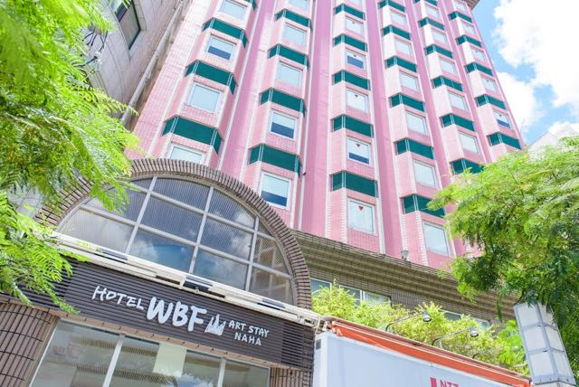

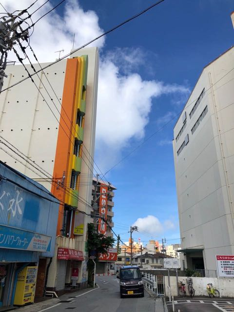

这家书店的体量超出了我的预期，共三层，单层面积大约就接近 2000 平米，印象中北京的西单图书大厦也不过这个规模，没有想到区区冲绳小县有这么大的书店。和国内一样，书店一楼最外层是「畅销书」展区，内层则分布着一排排立式书架。书架上密密麻麻地摆满了书，同一本书的册数并不多，而且是比较严谨地按照图书馆里的那套分类系统进行分类的。日本的书开本都偏小，包括很多严肃书籍，而且相当部分的书保留着从右向左竖排的传统。书店一楼有一个「门」子形的角落，里面赫然摆着色情小说，封面很是诱惑，内容是日语文本——我内心暗暗称奇。

我尝试寻找自己翻译的《WebGL 编程指南》的日语原版，向店员求助查找书的地方（冲绳英语的普及度不高，与当地人交流需要依靠翻译软件），店员带我到角落里一台上了年代的电脑前。我在老式的 JSP 风格的 Web 页面上查找到了我想要的那本书，只剩最后一本了，果断去拿下来。日本的书比较贵，比如这本书要 5800 円，算加上税再折算成人民币接近 400 元了，而国内的译本只需要 60~80 元。虽然贵，但我还是买下来当作纪念了。

从书店出来，如果继续沿着沖映通走的话，很快就到大路（和空铁平行的那条路）了。于是折进一条无名小路。小路上的行人就更少了弯弯绕绕，更没有什么行人了。路过一家自助洗衣店，门打开着，里面摆满了上下两排洗衣机（或者下面是洗衣机上面是烘干机），最里面的墙边还摆着案台和神龛，一个人都没有。我把头探进去看了看，又退了出来。

继续向前走，来到一家全家（FamilyMart）便利店（冲绳的全家遍地都是），买了一个饭团和一个鸡腿，买完才发现这家店内没有桌椅。这就尴尬了，在日本在公共场合吃东西似乎是一种挺不礼貌的行为。我只好把吃的收进包里，饿着肚子，继续前进。很快又到了大路，沿着这条与空铁平行的大路，到达了一家 MaxValue 超市（**マックスバリュ牧志店**），贩卖着水果、蔬菜、肉类等日常用品——看了看价格，胡萝卜大约要 6 元人民币一根，番茄大约要 10 元——和国内比还是挺贵的。

离开 MaxValue 超市，继续沿大路前进不远，就来到了牧志公园（**牧志公園**）。虽说是公园，其实是个很小的街心绿地，不过，这里似乎是游客聚集的地方，一棵大树的树荫下环绕排着一圈条凳，地上零零散散地散落着三四个塑料瓶。我心想，在这里吃东西应该不会遭受过于异样的眼光吧，于是就在树荫下的条凳上吃完了这天的午餐。两个白人老外在旁边的海盐冰淇淋店聊天；一对年轻男女在冰淇淋店背后的住宅楼下，靠着广告牌有说有笑；国际通（**国際通り**）路对面是一家酒店，一个父亲背后跟着女儿，正提着很大的行李箱上台阶。

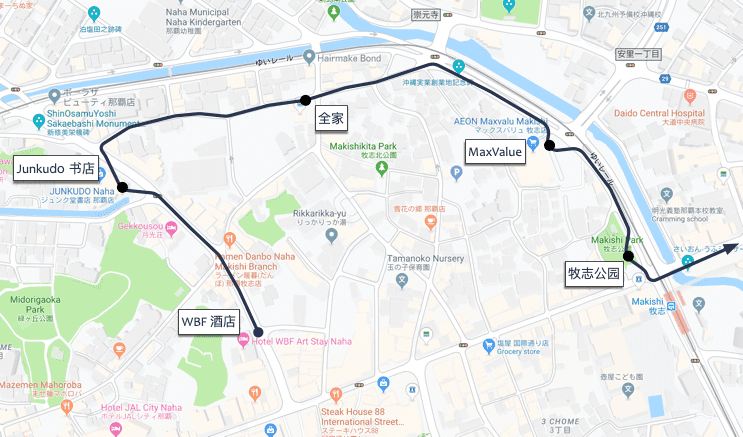

接着，我从天桥穿过空铁牧志站，沿着国际通向东前进。不得不提的是，日本的无障碍设施真不是随便说说的：盲道和电梯严丝合缝，电梯旁的使用指南上都刻着盲文。在这段路南侧，有一家看着挺大的综合体（Google 地图上搜不到准确的名字，只能搜到类似 Cargose Shopping Mall 之类的信息）。进去逛了逛。一楼是家大型免税店，二楼是几家餐厅，三楼居然是一家社区图书馆。虽然我很想上去看一看 ，但是通往三楼的电梯边立着类似「游客止步」的牌子。

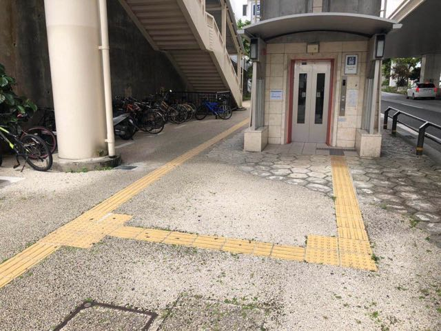

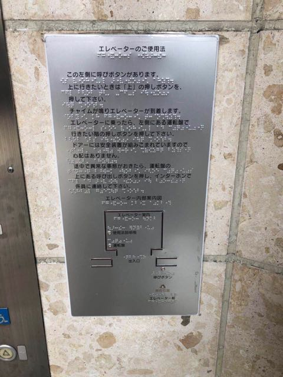

继续向东，来到了国际通和崇元寺通（**崇元寺通り**）路的交叉口。路东北有一家食品店，我在路对面等红灯。红灯的时间有点久，沿着**崇元寺通り**向西北望去，道路两侧静静耸立着建筑，澄蓝的天空从建筑形成的天际线的缺口处透出来，时间仿佛静止了一般。

红绿灯终于变绿，我穿过马路。我没有选择崇元寺通这条大路，而是沿着穿过安里（**安里**）社区的一条弯弯曲曲的小道前进。之前，我在地图上发现这条小道经过一座神社，所以故意选了这条路。这条路上的商店很少，两侧都是那种独门独栋的住宅即「一户建」。走了一段上坡路后，终于看到了神寺（**八幡神徳寺**）和神社（**琉球八社安里八幡宮**）。虽然对日本的宗教文化没有了解，但是当我看到常在宫崎骏电影中出现的「鸟居」（神社大门）时，还是有一丝兴奋的感觉。

神寺和神社位于小路拐弯的地方：神寺在左手边，由石头矮墙环绕。走进中庭，左侧是树木，右边似乎是一口水井，井上面有红色的龙头装饰；面前便是寺的主建筑了，透过移门上的玻璃，可看见内里铺着席子，还放置着几台电扇，倒是有几分烟火气，似乎是周围居民举行宗教集会的场所。

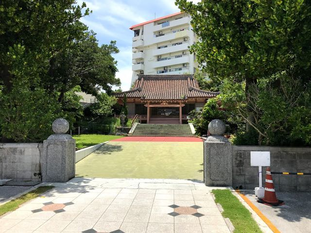

走出神寺左转，就是神社了。拾级而上，最上面一节台阶后立着石制的鸟居，鸟居明显有些年头了，比神社建筑要古老一个年代。进入鸟居，我站在一个小院子里，院子的角落里堆着一些幼儿的户外玩具——隔壁是托儿所（**愛泉保育園**）——整个院子打扫得很干净。面前立着一左一右两座纪念碑，纪念碑后就是神社的主建筑了，大红色的柱子，木墙，屋顶，坐落在半人高的基座上，檐下挂着一些纸片装饰。神社主建筑的大门敞开着，里面摆着案台和贡品。贡品的样子我一下子就认出来了，就是《你的名字》中装口嚼酒的那种瓷瓶。绕到建筑背后，发现了一间废弃的旧木屋，大概是此神社的旧址——现在的应该是某个时期重建的。我在院子里静静地站了二十分钟，没有一个人，风吹过纸片，神明似乎真的存在。

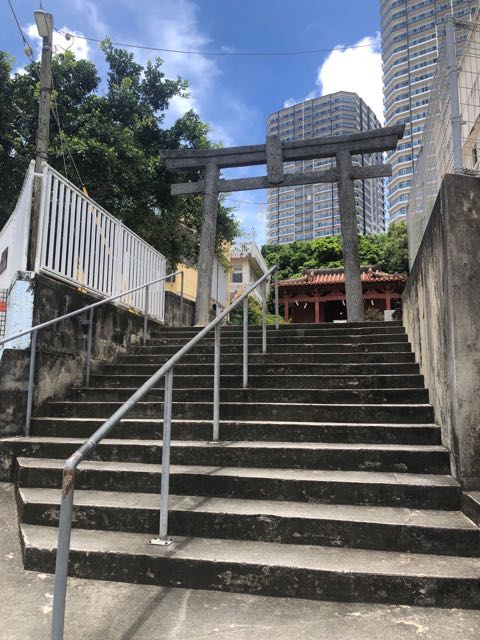

从神社出来，继续沿着这条小路向前（这是已向西），路两侧的「一户建」少了一些，取而代之的是一栋栋多层小楼。一层是车库，三三两两地停着小车，楼上像是一间间公寓，阳台整整齐齐地排列着——似乎不是当地人的居所，而是日本本岛的居民来度假时居住的公寓。迎面走来一个年轻的爸爸，背后跟着一儿一女，三人头发尽湿，小男孩只穿着短裤，像是游泳归来。可能是这条路上少有陌生人的缘故，我们擦肩而过时小男孩一直抬头盯着我看，搞得我都有点不好意思，走在前面的爸爸似乎也带着半分警惕和半分歉意地看了我一眼。走远后，我在一个橱窗前停下，橱窗里似乎公示着附近几所小学的施教范围（日本也有学区房吗？），这时我听见那个男孩在大声喊话，听到了**お父さん（Otōsan）**和**お母さん（Okāsan）**两个单词（稍微看过一点日本电影的对这两个词应该都不会陌生吧），我心里翻译了一下，大概是「妈妈，我们和爸爸回来啦！」。

继续向前走，路渐渐在下坡了。想来神社确实是建在山丘的最高处，在新都心的那些十几层高的摩天大楼还未建成时，神社也许是附近最高的建筑。继续向前走了几百米，突然豁然开朗了。路左侧不再有建筑，我才发现我已经站在一个小山坡上，左侧是陡峭的水泥防护坡（用于防止滑坡），约六七米高，坡底是一条宽阔的公路即 251 县道（**県道 251 号**）。站在山坡上向左侧望去，则是高高低低，鳞次栉比的房屋叠起来的那霸天际线。

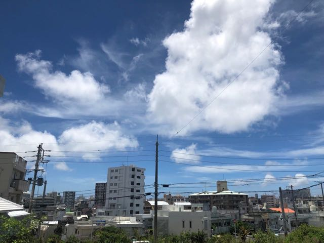

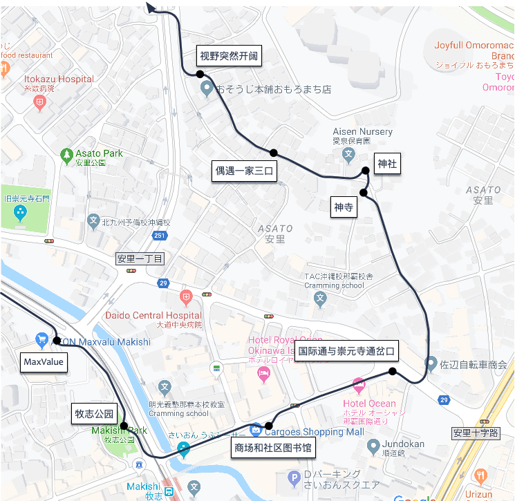

不远处有一座人行天桥。经过天桥来到大路西侧，沿着大路继续向前，这时其实距离新都心商业区已经不远了。我又累又渴，恰好经过一家全家（**ファミリーマートおもろまち二丁目店**）。买一杯冰淇淋，然后取了一点日元现金，在店里的窄桌边休息一下。右边隔着两个座位坐着一个穿校服的年轻妹子，背后是穿着蓝色衬衫的男子，都连着桌面上的 USB 接口为手机充着电（不得不说，国内的共享充电宝行业比日本领先很多）。虽然道路上行人很少，车辆也不多，但是全家却时不时地有人进进出出的，不知道他们是从哪里冒出来的。

离开全家，终于来到了新都心——**那霸**最大的商业区，这里坐落着冲绳最大的博物馆（**沖縄県立博物館・美術館**），可惜这几天正值维修闭馆期间，无法参观。在 Main Place（**サンエー那覇メインプレイス**）——一家商业综合体里逛了大约一个多小时，买了些纪念品；然后在雅马哈电器卖场（**ヤマダ電機 テックランド那覇本店**）逛了一个小时左右，买了一些 Switch 配件和两款 Switch 游戏；最后去 MUJI 无印良品工厂店（**無印良品 天久**）逛了一个多小时，随意买了一些东西。这里的商场几乎 100% 支持银联卡，70% 支持支付宝，除了和店员交流需要用 Google 翻译软件外，感受不到太大的与国内的差别。在 MUJI 配了两瓶熏香油——配合 MUJI 的熏香机使用。MUJI 的熏香油在国内似乎只卖调制完成的成品，在这里可以按照很详细的规则去自定义——店员会拿出大瓶的试剂原料和量杯现场调制。

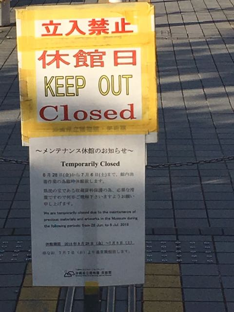

其实在新都心逛了蛮久，但是没有什么觉得很特别的值得记录下来的事情和情绪。从 MUJI 出来，才发现天已经暗了下来，路灯也亮起来了。晚上在 MUJI 前的麦当劳（**マクドナルド 天久りうぼう楽市店**）解决了晚餐。虽然日本的餐食比较贵，但是麦当劳的价格和国内基本是持平的：汉堡+薯条+饮料的组合折合成人民币在 40 元左右，算是非常廉价的餐食了。我独占了一张特别大的吧台上吃，吧台对面并排着几张小桌上围坐着六七个当地老人，活跃（有点激动）地交谈着什么。偶尔有客人从我旁边的小门进出，30 度的热浪卷到我的脸上，冲绳的夏天傍晚，竟然也是如此热情。

走出麦当劳，夜晚稍稍有些深了，我不由地加快了步伐。似乎应该早点回酒店才是，这么想着，我拿出手机打开地图，找一条最近的步道回家。首先通过一座天桥穿过县立博物馆前的大路。这座天桥是新都心公园（**新都心公園**）的一部分，连接着黄金森公园（**黄金森公園**）。天色很暗，天桥上没有灯，头顶着蓝黑的天空和若隐若现的云层，脚底下是黑黢黢的树丛，诺大的天桥上只有我一个人。黄金森公园位于天桥另一端，也没有路灯，夜色中有三五个人牵着宠物狗在公园遛狗，似乎还在低声交谈着什么。白天一整天，都没有看到宠物在街道上，也许这个破败的小公园是当地宠物圈的「圣地」吧，我心里想。

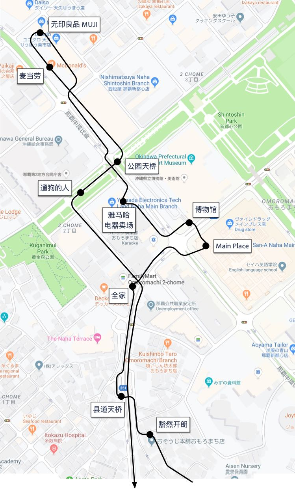

后面的旅途就挺普通了，从一条小路拐上了 251 县道，沿着这条大路径直大步前行，二十分钟就回到了上午经过的这家 MaxValue 超市。我没有选择国际通，而是绕行了 MaxValue 背后的小道。行走在夜间的小道上，五十或一百米开外就是热闹的国际通路，花花绿绿的店铺中透出温暖的灯光，各种肤色的游客络绎不绝；但是我站的地方，路灯昏暗，人迹罕至，小车安静地趴在各家各户门前。在这种奇妙的氛围下，我终于回到了酒店，结束了今天的徒步行程。

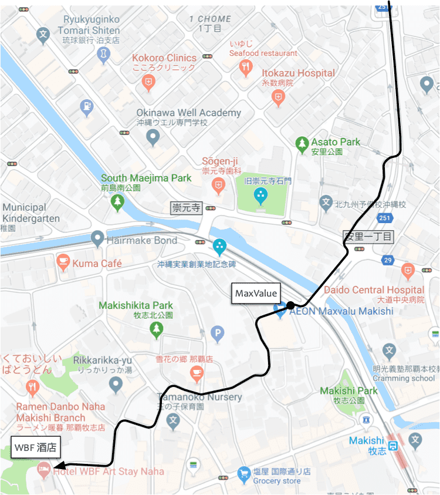

年纪渐长，有时候我会记不住上个月的事情，上周的事情，甚至记不住昨天发生的事情，我甚至开始写周记（顺便推荐一下 Day One 这个 App）来帮助记录生活中的点滴。但是这一天步行的所见所闻，直到半个月后的今天，很多细节依然仿佛就在眼前。这是为什么呢？我想了很久，终于想出了答案——那就是「孤独」的力量——这一天，我是孤独的（除了在雅马哈电器市场的那一个小时，是和我的同事王光九十一块儿逛的）。当我们浸没在日常的环境，日常的事情，日常的人物之中时，感官似乎会渐渐退化，对时间的流逝也渐渐麻木了；而这一天，远离杭州，远离工作，远离家人，当我一个人步行在一个完全陌生的地方时，我的眼睛、耳朵、鼻子又好像恢复了儿时的敏锐。不得不说，我很享受这份孤独——也许这也是一种旅行的意义吧。
