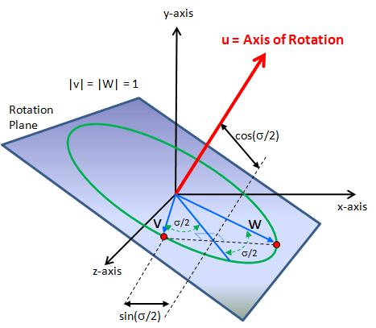

# 四元数旋转公式证明

之前学习图形学的时候，绕任意轴旋转的旋转矩阵可以由四元数推导出来。我觉得很神奇，百思不得其解其背后的原理。直到找到一篇靠谱的文献，细细地研究了好几个晚上，才弄明白了。想通的那一刻，成就感真是满满的。所以，粗略地记下来吧。

四元数是一种高阶复数，它可以用来刻画空间中的旋转。四元数 $q$ 表示为：

\begin{equation}q=(x,y,z,w)=xi+yj+zk+w\end{equation}

其中，$i$，$j$，$k$ 满足：

\begin{equation}i^2=j^2=k^2=-1\end{equation}

\begin{equation}ij=k,jk=i,ki=j\end{equation}

由于i，j，k的性质和笛卡尔坐标系三个轴叉乘的性质很像，所以可以将四元数写成一个向量和一个实数组合的形式：

\begin{equation}q=(\vec{v}+w)=((x,y,z),w)\end{equation}

可以推导出四元数的一些运算性质，包括：

四元数乘法

\begin{equation}q_1\ast q_2=(\vec{v_1}\times \vec{v_2}+w_1\vec{v_2}+w_2\vec{v_1}, w_1w_2-\vec{v_1}\cdot \vec{v_2})\end{equation}

共轭四元数

\begin{equation}q^{\ast}=(-\vec{v},w)\end{equation}

四元数的平方模

\begin{equation}N(q)=N(\vec{v})+w^2\end{equation}

四元数的逆

\begin{equation}q^{-1}=\frac{q^{\ast}}{N(q)}\end{equation}

等等。四元数可以看做是向量和实数的一种更加一般的形式，向量可以视作为实部为0的四元数，而实数可以是作为虚部为0的四元数。上述四元数的运算性质也是实数或向量的运算性质的更一般的形式。

那么，四元数如何表示三维旋转呢？

假设有一个旋转，绕单位向量(x,y,z)表示的轴，旋转ϴ角度，可令四元数q为：

\begin{equation}q=((x,y,z)\sin{\frac{\theta}{2}},\cos{\frac{\theta}{2}})\end{equation}

那么某个点P，写成四元数的形式((x,y,z),0)，其旋转后的坐标P'为：

\begin{equation}p'=qpq^{-1}\end{equation}

接下来我们来证明这一点。

首先，我们证明

\begin{equation}qpq^{-1}=(sq)p(sq)^{-1}\end{equation}

其中s为实数。显然

\begin{equation}(sq)p(sq)^{-1}=sqpq^{-1}s^{-1}=pqp^{-1}\end{equation}

此时，我们可以将q看做是单位矩阵，因为如果q不是单位矩阵，我们就可以乘以一个常数s将其化为单位矩阵。

然后，我们证明qpq^{-1}和p的模长相等

下面将q视为单位四元数：

\begin{equation}q^{-1}=q^{\ast}\end{equation}

四元数q的标量:

\begin{equation}S(q)=(q+q^{\ast})/2\end{equation}

那么：

\begin{equation}2S(qpq^{-1})=2S(qpq^{\ast})=qpq^{\ast}+(qpq^{\ast})^{\ast}=qpq^{\ast}+qp^{\ast}q^{\ast}=q(p+p^{\ast})q^{\ast}=q2S(p)q^{\ast}=2S(p)\end{equation}

最后，我们证明

\begin{equation}p'=qpq^{\ast}\end{equation}

如图所示，u为旋转轴，旋转角度为σ，向量v旋转到w处。旋转到σ/2处为k（图中未标出）。

下面也用相同的字母指代四元数，如u就表示向量u的四元数形式((ux,uy,uz),0)。

首先，令u方向上的单位向量为u（为了方便，命名不变，后面的u都是指旋转轴方向的单位四元数），那么根据q的定义，参见四元数乘法法则：

\begin{equation}q=(\vec{u}\sin{\frac{\theta}{2}},\cos{\frac{\theta}{2}})=(\vec{v}\times\vec{k},\vec{v}\cdot \vec{k})=(\vec{v},0)(-\vec{k},0)=kv^{\ast}\end{equation}

现在令

\begin{equation}w=qvq^{\ast}\end{equation}

如果能证明w与v的夹角是σ，那么就说明w确实是v旋转σ得到的，整个命题就得证了。

注意v，k和w都是实部为0的单位四元数，表示单位向量，我们有：

\begin{equation}wk^{\ast}=(qvq^{-1})k^{\ast}=qvq^{\ast}k^{\ast}=qvvk^{\ast}k^{\ast}=q\end{equation}

所以

\begin{equation}wk^{\ast}=kv^{\ast}\end{equation}

上面的式子拆分成实部和虚部，虚部表明w与-k的平面和k与-v的平面重合，实部表明w和-k之间的夹角与k和-v之间的夹角相等，都是π-σ/2。这就说明了w与v的夹角是σ，原命题就得证了。

参考文章：

* [http://www.cs.ucr.edu/~vbz/resources/quatut.pdf](http://www.cs.ucr.edu/~vbz/resources/quatut.pdf)

（完）