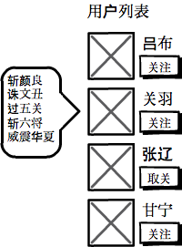
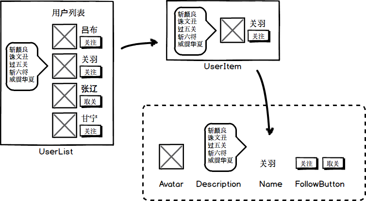
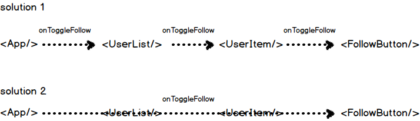

# React 实践心得：说说 children 的使用

React 的初学者通常会犯一个错误是：不大会使用（甚至完全不使用）组件的 children 属性。其实，对 children 的合理使用，是「组件化」的基础。

这篇短文就通过一个例子，说说应该怎样合理地使用 children。

假设我们要做下图所示的一个用户列表组件：具体要求是这样的：

* 顶部有「用户列表」的字样。
* 用户列表中应显示用户的头像，名称，描述，还有一个关注按钮。
* 用户的描述信息默认不显示，鼠标 hover 到用户头像上时，用气泡显示描述信息。
* 点击「关注」按钮即可关注用户，随之按钮文案变成「取关」（取消关注）。



首先拆解一下上面的原型：

* 我们首先需要一个用户列表 UserList，它在最外层。
* UserList 组件中有一组用户信息组件 UserItem。
* 用户信息组件包括头像 Avatar，名字 Name，描述 Description，关注按钮 FollowButton。



`UserList` 会被其外层容器组件调用。如果你对 React 和「组件化」思想比较缺乏经验，很有可能会写出这样的代码来。

```js
// 不好的实现
// UserList 的外层容器组件
class App extends React.Component {
  constructor(props) {
    super(props);
    this.state = {
      users: [{
        id: '001',
        name: '关羽',
        description: '斩颜良诛文丑巴拉巴拉',
        avatar: 'https://关羽的自画像.jpg',
        followed: false  // 是否已关注
      }, ...otherUsers]
    }
  }

  doToggleFollow(id) {
    // 关注、取消关注的请求
    requestToggleFollow(id, ()=>{
      const users = _.clone(this.state.users);
      const user = _.find(users, {id});
      user.followed = !user.followed;
      this.setState({users});
    })
  }

  render() {
    return (<div>
      <UserList users={this.state.users}
                onToggleFollow={id=>this.doToggleFollow(id)}
      />
    </div>)
  }
}
```

用户的数据，通常是在较外层的容器维护（这里在 `App` 组件的 `state` 下），虽然现在只有 `UserList` 用到了用户数据，但如果 App 下还有其他组件，它们几乎也一定会使用这份数据。

总之，现在看上去好像没有什么问题。我们使用了一个「封装良好」的 `UserList` 组件，这个组件负责搞定用户列表组件内的所有事情。如果你比较敏感的话，你可能会觉得把 `onToggleFollow` 方法传给 `UserList` 这件事似乎有些不妥，那又怎样，总之 `render` 方法看上去很干净，不是吗？

下面我们来看 `UserList` 的实现。

```js
// 不好的实现
const UserList = props => {
  const {users, onToggleFollow} = props;
  return (
    <div>
      <h3>用户列表</h3>
      {
        users.map((u, i)=>
          <div key={i}>
            <UserItem user={u} onToggleFollow={onToggleFollow}/>
          </div>
        )
      }
    </div>
  )
};
```

我们把从外面传过来的 `onToggleFollow` 继续向里传递给了 `UserItem` 组件。虽然有点小不爽，但是我忍了！看 `UserItem` 的实现：

```js
// 不好的实现
class UserItem extends Component {
  constructor(props){
    super(props);
    this.state = {
      hover: false
    }
  }
  
  render() {
    const {user, onToggleFollow} = this.props;
    return (
      <div>
        <Avatar src={user.avatar}
                onMouseEnter={()=>this.setState({hover: true})}
                onMouseLeave={()=>this.setState({hover: false})}
        />
        <Name value={user.name}/>
        <FollowButton isFollowing={user.followed} onClick={()=>onToggleFollow(user.id)}/>
        {this.state.hover ? <Description value={user.description}/> : null}
      </div>
    )
  }
}
```

`UserItem` 有一个状态 `hover`，表示用户的鼠标是否悬浮在头像上方。这个状态也用来判断是否显示用户的介绍 `Description` 组件。

`onToggleFollow` 方法继续向下传递，实在是有点忍不了了！

最后我们看下最底层，最简单的这几个组件：`Avatar`，`Name`，`FollowButton` 和 `Description`。

```js
// 不好的实现

// user-item-avatar.js
class Avatar extends React.Component {
  componentDidMount(){
    const img = this.refs.img;
    img.addEventListener('mouseenter', this.props.onMouseEnter);
    img.addEventListener('mouseleave', this.props.onMouseLeave);
  }
  render() {
    return 
  }
}

// user-item-name.js
const Name = props => <div>{props.value}</div>;

// user-item-follow-button.js
const FollowButton = props => (
  <button onClick={props.onClick}>{props.isFollowing ? '取消关注' : '关注'}</button>
);

// user-item-description.js
const Description = props => <div>{props.value}</div>;
```

我们可以看到，`onToggleFollow` 方法从最外层的 `App` 组件开始向内传递，经过 `UserList` 和 `UserItem`，最终落在了 `FollowButton` 上。其实，这个行为（关注与否）与中间的两层组件 `UserList` 和 `UserItem` 并没有什么关系，如果某一天「关注」按钮变成了「发信」按钮，`UserList` 和 `UserItem` 不应该为此作任何修改。



也就是说，上面的这个 `UserList` 看上去把用户列表内的逻辑都封装了起来，但它并不是一个足够「组件化」的组件。一个合格的「组件化」的 `UserList` 应该能像下面这样被调用。

```js
// UserList 的外层容器组件
class App extends React.Component {
  constructor(props) {
    super(props);
    this.state = {
      users: [{
        id: '001',
        name: '关羽',
        description: '斩颜良诛文丑巴拉巴拉',
        avatar: 'https://关羽的自画像.jpg',
        followed: false  // 是否已关注
      }, ...otherUsers]
    }
  }

  doToggleFollow(id) {
    // 关注、取消关注的请求
    requestToggleFollow(id, ()=>{
      const users = _.clone(this.state.users);
      const user = _.find(users, {id});
      user.followed = !user.followed;
      this.setState({users});
    })
  }

  render() {
    return (<div>
        <UserList>{
          users.map((user, i) =>
            <UserItem key={i}>
              <Avatar src={user.avatar}/>
              <Name>{user.name}</Name>
              <FollowButton isFollowing={user.followed} onClick={()=>this.doToggleFollow(user.id)}/>
              <Description>{user.description}</Description>
            </UserItem>
          )
        }</UserList>
    </div>)
  }
}
```

对比上述两种 `UserList` 的用法，可见前者的用法虽然简单，但对调用者而言，却像一个令人不安的「黑盒子」，完全不知道 `UserList` 会在内部干出什么事情来，而且还需要传一个莫名其妙的 `onToggleFollow` 函数。

相较之下，后者的用法虽然看上去复杂一些，但是对调用者来说，组件内部的结构更加清晰，也更容易掌控。数据和行为都显而易见地绑定在与之直接关联的组件上，用户根本不需要查看 `UserList` 的实现代码就能很清楚地知道，这个组件的真正功能。

而这两种组件的差别，最表面的就是是否使用了 `children` 属性。

```js
// 第一种用法
render() {
  return (<div>
    <UserList users={this.state.users}
              onToggleFollow={id=>this.doToggleFollow(id)}
    />
  </div>)
}

// 第二种用法
render() {
  return (<div>
    <UserList>{
      users.map((user, i) =>
        <UserItem key={i}>
          <Avatar src={user.avatar}/>
          <Name>{user.name}</Name>
          <FollowButton isFollowing={user.followed} onClick={()=>this.doToggleFollow(user.id)}/>
          <Description>{user.description}</Description>
        </UserItem>
      )
    }</UserList>
  </div>)
}
```

实现第二种 `UserList`，需要在渲染组件的时候，在特定的「坑位」上加上 `this.props.children`。如下所示：

```js
const UserList = props => (
  <div>
    <h3>用户列表</h3>
    {this.props.children}
  </div>
);
```

`UserItem` 相对会复杂一些：

```js
class UserItem extends React.Component {
  constructor(props) {
    super(props);
    this.state = {
      hover: false
    }
  }

  render() {
    const {children: [avatar, name, followButton, description]} = this.props;
    const onMouseEnter = () => this.setState({hover: true});
    const onMouseLeave = () => this.setState({hover: false});
    return (
      <div>
        {React.cloneElement(avatar, {onMouseEnter, onMouseLeave})}
        {name}
        {followButton}
        {this.state.hover ? description : null}
      </div>
    )
  }
}
```

由于我们在 `UserItem` 内部放了多个组件，所以在 `UserItem` 中，`children` 是一个数组，需要对数组中的每一个元素进行额外处理。

第1个元素是头像 `avatar`，它的 hover 状态影响到用户描述的显示与否，所以需要在这一步绑定事件。但是 ReactElemnt 是不可改变（immutable）的，我们使用 `React.cloneElement` 创建了一个新的 ReactElement。

第4个元素的显示与否，取决于 `state.hover`，十分合理。

最后，我们可以总结一下，`UserList` 组件对于用户的直观感受：

第一种实现：

* 用户列表 UserList：
  * 需要传入用户数据（用户数据里的结构不大清楚）。
  * 还需要传入一个不知干什么的函数（研究了一下，应该是点击关注按钮后调用）。

第二种实现：

* 用户列表 UserList：
  * 其中包括 UserItem 的列表。
* 用户信息 UserItem：
  * 包括用户头像 Avatar，数据来源于 user.avatar。
  * 包括用户名字 Name，数据来源于 user.name。
  * 包括一个按钮 FollowButton，需要设定 user.isFollowing 状态，用户点击后调用函数进行关注/取关。
  * 包括用户描述 Description，数据来源于 user.description。
  * 发现只有鼠标 hover 在头像上时才会显示出来，但是我可以不需要关心这件事。

很显然，上面的第二种实现方案确实比第一种的质量高很多。