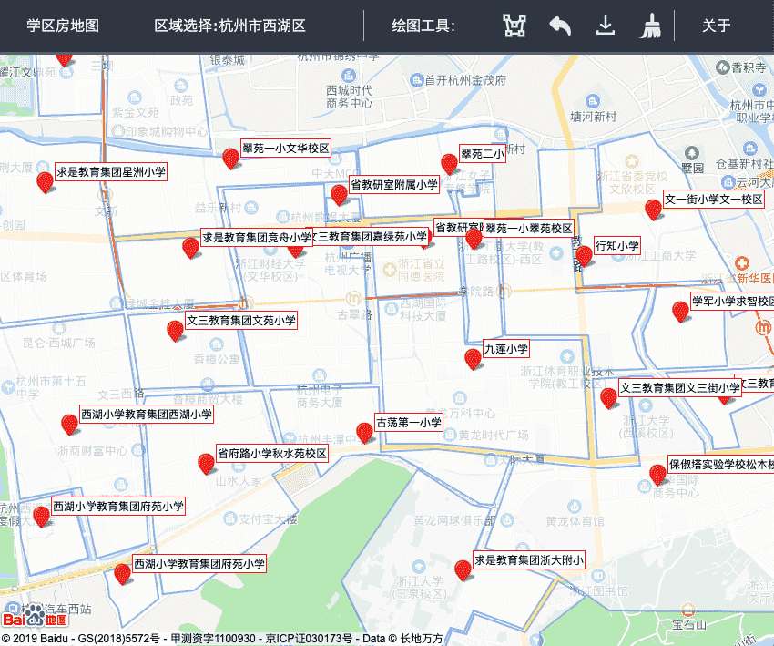
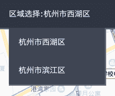
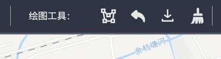
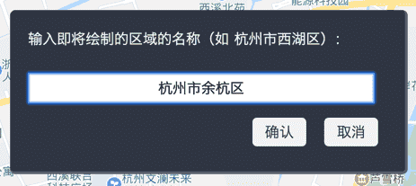
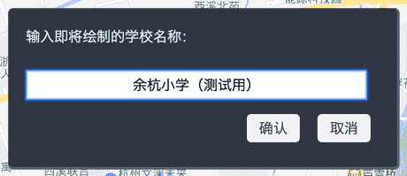
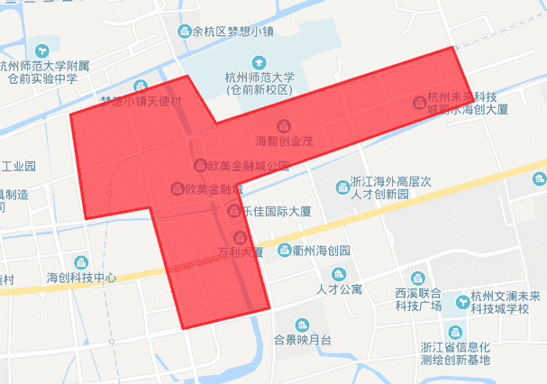
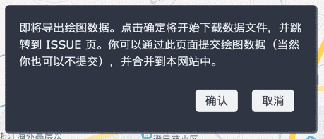

# 在线学区房地图：一个业余项目

利用周末的时间做了一个 side project，可以在线展示各小学的施教区范围，可作购买学区房之前决策参考之用，非常直观！写篇文章介绍下用法吧，哈哈。

首先界面长成这样，点击 **[直达链接](https://xieguanglei.github.io/schools-map/)** 即可访问。网站是开源的，托管在 [github](https://github.com/xieguanglei/schools-map) 上。

数据上目前仅做了杭州的西湖区和滨江区；用户可以在这张地图上直接绘图，然后把绘图数据发 ISSUE 或者 PR 来添加或更新数据。

## 用法

### 浏览学区划分

直接进入网站，即可浏览默认区域（杭州市西湖区）的学区房划分。鼠标拖拽（按住左键移动）可平移地图，鼠标滚轮可放大缩小地图。每个学校的学区范围用淡蓝色的多边形覆盖在地图上，可以很直观地看到哪些小区属于这个小学的施教区。

网站可以支持多个区域的数据，可以点击菜单栏中的「区域选择」来选择显示另一个区域的学区划分。（滨江区仅完成了 4 所较热门小学的学区。）

### 绘制数据和提交

用户可以在平台上直接绘制自己关心的学区数据，然后通过 PR 或 issue 选择提交到 github 仓库。绘制需要用到绘制工具栏：

四个按钮的作用分别为「绘图」、「撤销」、「导出」、「清除」。

点击「绘图」按钮，会分别提示你输入绘制的区域名称、绘制的学校名称，然后鼠标就会从「手」形变成「十字」形，这提示你可以在地图上进行绘图操作了。

在地图上依次单击选点，勾勒出学区范围的形状（正在绘图的区块是红色的）；在完成最后一个点时，使用双击表示勾勒绘图操作完成，学区的范围转为蓝色，并附上了包含学校名称的标记。这样，一所学校的施教区就绘制完成了（这里示例中的学区是我随意勾勒的，并不是真实数据）。

再次点击「绘图」按钮，一所接一所学校地完成其所属学区的绘制操作。如果对绘图结果不满意，可以点击「撤销」按钮取消上一次绘制的内容。绘图过程中关闭页面重新打开，不会丢失已绘制的数据。

点击「导出」按钮将下载一份文本文件，其中包含了你的绘图数据。你可以通过访问 issue 页将此附件提交给我，或者直接通过 PR 来提交数据的更改。

点击「清除」按钮即可清空你之前所有的绘图数据。如果你已经完成了提交，或者想要绘制一个新的区域，你需要先清除之前的绘制数据。

## 声明

* 此地图的学区划分为 Github 上的网友个人整理而成，完全存在划分不准确甚至错误的可能性。本工具提供的信息仅供参考，不承担任何由信息错误导致损失的责任，用户请自行验证信息的真实性。
* 本工具纯粹为兴趣制作，不产生任何盈利。本地图由 Baidu 地图非商用 SDK 支持。

## 感想

偶尔做做业余项目感觉不错，有种呼吸新鲜空气的感觉。
